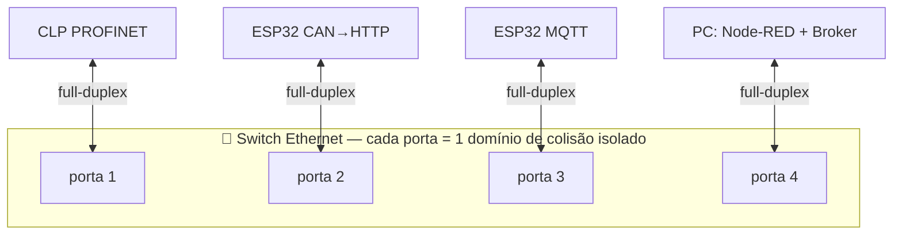

# 🚦 Controle de Acesso ao Meio (MAC) entre as redes

Este documento explica **como cada célula disputa o meio físico** e **por que não há colisões destrutivas quando as três redes convergem no backbone**. É o complemento prático do [`mapeamento-osi.md`](mapeamento-osi.md): o acesso ao meio é a **subcamada MAC da camada 2 (Enlace)** do modelo OSI.

---

## 0. O problema fundamental

Sempre que **dois ou mais transmissores compartilham o mesmo meio** (um fio, um par diferencial, o ar), existe o risco de dois falarem ao mesmo tempo — uma **colisão**. O sinal resultante fica corrompido e a informação se perde. A subcamada **MAC** é o conjunto de regras que decide *quem pode transmitir e quando*, resolvendo essa disputa.

Existem três grandes estratégias, e **este projeto usa as três ao mesmo tempo**, uma por célula:

| Estratégia | Filosofia | Onde aparece no NEXUS |
|-----------|-----------|-----------------------|
| **CSMA/CD** — *Collision Detection* | "Fale; se colidir, pare e tente de novo" | Ethernet clássico (base histórica do backbone) |
| **CSMA/CA** — *Collision Avoidance* | "Evite colidir antes de falar" | Wi-Fi 802.11 (enlaces dos ESP32) |
| **CSMA/CR** — *Collision Resolution* | "Colida, mas de forma que o mais prioritário sobreviva" | CAN (Célula 2) |

> **CSMA** = *Carrier Sense Multiple Access*: antes de transmitir, o nó "escuta a portadora" (verifica se o meio está ocupado). O que muda entre CD/CA/CR é **o que se faz quando há disputa**.

---

## 1. Célula 2 — CAN: CSMA/CR (arbitragem bit a bit não destrutiva)

O CAN é o caso mais elegante e o melhor gancho teórico da apresentação.

### Princípio de funcionamento
O barramento CAN tem dois níveis lógicos: **dominante (0)** e **recessivo (1)**. Eletricamente é um **AND cabeado** (*wired-AND*): se qualquer nó impõe `0` (dominante), o barramento vai a `0`, não importa quantos imponham `1`.

Quando vários nós começam a transmitir simultaneamente, todos enviam o **identificador (ID)** bit a bit e, ao mesmo tempo, **leem de volta o barramento**. A regra:

- Se o nó envia `1` (recessivo) mas lê `0` (dominante) → ele **perdeu a arbitragem** e se cala imediatamente.
- Quem envia `0` continua.

Como IDs menores têm mais bits `0` à esquerda, **o menor ID (maior prioridade) vence e transmite sem nem perceber que houve disputa.** Nenhum frame é destruído — daí *Collision Resolution*, não *Detection*.

### Exemplo numérico
Três nós disputam com IDs de 11 bits:

```
Nó A: ID = 0x0F0 = 000 1111 0000
Nó B: ID = 0x100 = 001 0000 0000
Nó C: ID = 0x0F5 = 000 1111 0101
```

Bit a bit (do mais significativo ao menos):

| Bit | A | B | C | Barramento (AND) | Quem sai? |
|:---:|:-:|:-:|:-:|:---:|-----------|
| 10  | 0 | 0 | 0 | 0 | todos seguem |
| 9   | 0 | 0 | 0 | 0 | todos seguem |
| 8   | 0 | **1** | 0 | 0 | **B perde** (enviou 1, leu 0) |
| 7   | 1 | – | 1 | 1 | A e C seguem |
| 6   | 1 | – | 1 | 1 | seguem |
| 5   | 1 | – | 1 | 1 | seguem |
| 4   | 1 | – | 1 | 1 | seguem |
| 3   | 0 | – | 0 | 0 | seguem |
| 2   | 0 | – | **1** | 0 | **C perde** |
| ... | ... | | | | **A vence** |

Resultado: **A transmite integralmente**; B e C reenviam depois. Zero retransmissão de A, zero janela de colisão perdida.

### Vantagens
- **Determinístico:** a mensagem de maior prioridade tem latência garantida (essencial em controle veicular/industrial).
- **Sem perda de banda por colisão** (ao contrário do CSMA/CD).
- Robusto a ruído (par diferencial CAN_H/CAN_L).

### Desvantagens
- Mensagens de baixa prioridade podem "passar fome" (*starvation*) sob tráfego alto.
- Exige sincronismo de bit rígido → limita **distância × taxa** (ex.: 1 Mbit/s só até ~40 m).
- Não tem camadas 3/4 → precisa do ESP32 como **gateway** para chegar ao backbone.

### Eficiência espectral / imunidade a ruído
Taxa baixa (≤ 1 Mbit/s) mas altíssima imunidade por sinalização diferencial (rejeição de modo comum). O overhead de arbitragem é "gratuito" — acontece dentro do próprio campo de ID.

---

## 2. Enlaces Wi-Fi dos ESP32 — CSMA/CA (802.11 DCF)

Os ESP32 (Célula 2 no upload HTTP e Célula 3 no MQTT) sobem os dados por **Wi-Fi**, que **não detecta colisão** — no rádio, um nó não consegue transmitir e ouvir a colisão ao mesmo tempo. Por isso usa **evitação (CA)**.

### Princípio (DCF — *Distributed Coordination Function*)
1. **Carrier sense:** escuta o canal. Se livre por um intervalo **DIFS**, pode transmitir.
2. **Backoff aleatório:** mesmo com canal livre, cada nó espera um número **aleatório** de *slots* (janela de contenção CW). Quem sortear o menor tempo transmite primeiro → reduz a chance de dois começarem juntos.
3. **Confirmação (ACK):** o receptor responde com ACK após **SIFS**. **Sem ACK = assume colisão/perda** → dobra a janela CW (*exponential backoff*) e tenta de novo.
4. **RTS/CTS (opcional):** para o **problema do nó escondido** (dois nós que se ouvem no AP mas não entre si), o *handshake* Request-to-Send/Clear-to-Send reserva o meio antes.

### Vantagens
- Funciona sem fio, sem infraestrutura de cabo — flexibilidade de bancada.
- Backoff exponencial estabiliza a rede sob carga.

### Desvantagens
- **Não determinístico:** latência e jitter variáveis (ruim para controle duro).
- **Overhead alto:** DIFS + backoff + SIFS + ACK reduzem o throughput útil bem abaixo da taxa nominal.
- Sujeito a interferência, nó escondido e *exposed node*.

### Impacto no projeto
É a razão pela qual **a malha de controle roda no ESP32, não no Node-RED**: se dependesse do Wi-Fi para fechar a malha, o jitter da CSMA/CA comprometeria o controle. O Wi-Fi carrega só **telemetria e override**, onde atraso variável é tolerável.

---

## 3. Backbone Ethernet — CSMA/CD → **Ethernet comutado (sem colisão)**

### O que era o CSMA/CD
No Ethernet clássico com **hub/barramento coaxial**, todos os nós compartilhavam um **domínio de colisão**. A regra:
1. Escuta o meio; transmite se livre.
2. Continua ouvindo **durante** a transmissão. Se detectar colisão, envia um **JAM**, aborta e espera um tempo aleatório (**backoff exponencial binário**) antes de retentar.

Isso funciona, mas **desperdiça banda** em colisões e degrada muito acima de ~40 % de utilização.

### O que realmente acontece no NEXUS
O backbone usa um **switch**, não um hub. Isso muda tudo:

- **Cada porta do switch é seu próprio domínio de colisão.** Como só há **um** dispositivo por porta e o enlace é **full-duplex** (par de transmissão e par de recepção separados), **um nó pode transmitir e receber ao mesmo tempo sem nunca colidir.**
- O **CSMA/CD é efetivamente desativado** em enlaces full-duplex comutados. Não há disputa de meio entre as células no backbone.
- A contenção que sobra não é mais "colisão", e sim **enfileiramento**: se dois quadros chegam para a mesma porta de saída ao mesmo tempo, o switch **bufferiza e serializa** (e pode priorizar por VLAN/QoS 802.1p, como o PROFINET usa).



> ✅ **Conclusão-chave para a banca:** *entre as três células, no backbone, não há colisão.* O switch isola os domínios e serializa por enfileiramento. A disputa "clássica de meio" só existe **dentro** de cada célula (CAN e Wi-Fi).

---

## 4. Camada de aplicação — o broker MQTT também "serializa"

Mesmo que dois ESP32 publiquem "ao mesmo tempo", **não há colisão de aplicação**: o MQTT é uma **topologia estrela** em torno do **broker**. Cada cliente tem uma **conexão TCP dedicada** com o broker; o TCP já garante entrega ordenada e sem colisão naquele fluxo. O broker **recebe, enfileira e redistribui** as mensagens para os assinantes. A "arbitragem" aqui é o próprio broker processando as conexões — não há meio compartilhado no nível de aplicação.

O mesmo vale para o **HTTP REST** (Célula 2) e o **S7/ISO-on-TCP** (Célula 1): todos rodam **sobre TCP**, ou seja, **sobre o Ethernet comutado full-duplex** — portanto herdam a ausência de colisão do backbone.

---

## 5. Quadro comparativo geral

| Aspecto | CAN (Célula 2, local) | Wi-Fi 802.11 (enlaces ESP) | Ethernet comutado (backbone) |
|---------|----------------------|----------------------------|------------------------------|
| Estratégia MAC | CSMA/**CR** | CSMA/**CA** | CSMA/CD *desativado* (full-duplex) |
| Colisão? | Ocorre, mas **não destrutiva** (arbitragem) | Evitada; se ocorre, ACK falta → backoff | **Não ocorre** (1 nó/porta) |
| Determinismo | **Alto** (por prioridade de ID) | Baixo (backoff aleatório) | Alto (enfileiramento + QoS) |
| Contenção resolvida por | Prioridade do identificador | Backoff exponencial + ACK | Buffer/fila do switch |
| Camadas OSI | 1–2 (precisa de gateway) | 1–2 (sobe p/ TCP/IP) | 1–2 (base de TCP/IP) |
| Latência sob carga | Garantida p/ alta prioridade | Cresce e varia (jitter) | Cresce previsível (fila) |
| Papel no projeto | Célula CAN → ESP32 gateway | Transporte de telemetria/override | Convergência das 3 células |

---

## 6. Por que isso importa no dia do teste

1. **Autonomia:** como o controle roda local (CAN no ESP, malha térmica no ESP MQTT, PLC no S7), a disputa de meio *interna* não trava o processo — a célula opera sozinha.
2. **Visibilidade global:** a ausência de colisão no backbone comutado garante que a telemetria das três células chega ao Node-RED de forma confiável e ordenada (TCP).
3. **Diagnóstico:** o bit `diag/online` (via **LWT** do MQTT) detecta um nó que sumiu — é o "controle de erro" na ponta, cobrindo o caso em que backoff/retransmissão não resolveram porque o nó realmente caiu.
4. **Risco a monitorar:** o **Wi-Fi** é o elo mais frágil (CSMA/CA não determinístico, interferência na sala). Se houver perda intermitente na demonstração, o suspeito nº 1 é a contenção/ruído no canal 802.11, **não** o backbone cabeado.

---

## 7. Erros comuns (para não cair na banca)

- ❌ *"O backbone Ethernet usa CSMA/CD para resolver colisões entre as células."*
  ✅ Em **enlace comutado full-duplex**, o CSMA/CD é **desligado**; não há colisão entre células — há **enfileiramento** no switch.
- ❌ *"CAN detecta colisão e retransmite igual Ethernet."*
  ✅ CAN **resolve** a colisão por arbitragem de prioridade **sem destruir** o frame vencedor (CSMA/CR ≠ CSMA/CD).
- ❌ *"MQTT tem colisão quando dois publicam juntos."*
  ✅ MQTT é **estrela via broker sobre TCP**; não há meio compartilhado na aplicação.
- ❌ Confundir **domínio de colisão** (resolvido por switch) com **domínio de broadcast** (resolvido por roteador/VLAN).
