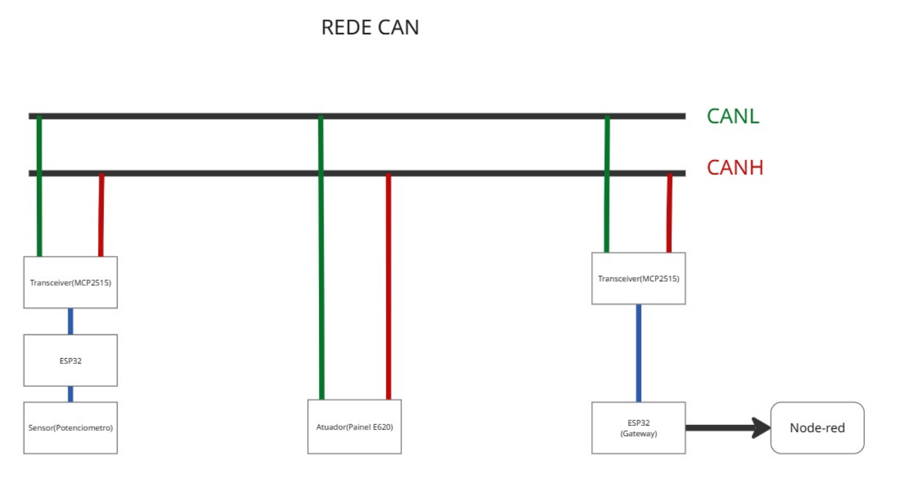

# 🟥 Rede CAN — Célula 2 (Alexandre & Alvaro)

---

## 1. Descrição do projeto

O protocolo local utilizado nesta célula é o **CAN (Controller Area Network)** operando a uma taxa de barramento industrial de **250 Kbps**. A rede é composta por microcontroladores **ESP32** acoplados a controladores autônomos de protocolo **MCP2515** via interface de periféricos serial (**SPI**). O ESP32 principal atua como o nó mestre/gateway local da bancada, coletando os sinais do barramento e disponibilizando uma interface gráfica de monitoramento por meio de um Web Server HTTP nativo. 

O grande objetivo desta célula é ler de maneira contínua os dados de um sensor analógico (potenciômetro) mapeado sob o identificador exclusivo CAN `, processar os pacotes para o cálculo de velocidade real em km/h e comandar um painel atuador de indicadores (Painel E620) via ID CAN `0x4D2`. O Gateway ESP32 também atua como **ponte** para o backbone (Node-RED) por meio de requisições assíncronas **HTTP (POST/GET)** em formato de texto puro (`text/plain`) e JSON. A grande vantagem desse design é garantir a operação offline e robusta da rede de campo CAN, enquanto permite a convergência com o sistema supervisório centralizado.

| Item | Valor |
|------|-------|
| ponte backbone  | **Microcontrolador ESP32 WROOM DEV-KIT V1** |
| Controlador CAN | **Módulo MCP2515** + Transceptor TJA1050 (Cristal de 8MHz / SPI) |
| Atuador | **Painel de Indicadores de Bancada E620** ( ID `0x4D2`) |
| Sensor | **Pontenciometro(250kohms) + Microcontrolador ESP32 WROOM DEV-KIT V1** ( ID `0x100`) |
|comunicação com backbone | **HTTP Client (POST / GET)** nativo via `esp_http_client` (MIME: `text/plain`) |
| Software | ESP-IDF V5.4|

### Variáveis Disponíveis ao Node-RED / Servidor HTTP

| Nome | Rota / Endpoint | Tipo no Node-RED | Uso / Formato de Origem |
|------|----------------|-------------------|-------------------------|
| `g_valor_can_bruto` | `/data` (JSON) | string | Valor decimal bruto do potenciômetro (origem `uint16_t` na CAN) |
| `g_velocidade` | `/data` (JSON) | string | Velocidade física calculada em km/h (origem `float`) |
| `g_slider_value` | `/set_slider` | string | Posição do Slider alterada na página HTML (origem `int`) |
| `g_node_red_slider` | `/set_nodered_value` | string | Setpoint enviado do Node-RED para a rede CAN (convertido para `int` no ESP32) |
| `g_node_red_freq` | `/set_nodered_freq` | string | Referência de frequência do CLP enviada ao ESP32 como texto puro |
| `ligar` | `/ligar` (POST) | string | Comando de partida enviado como o texto `"true"` |
| `desligar` | `/desligar` (POST) | string | Comando de paragem enviado como o texto `"true"` |

---

## 2. Diagrama de blocos

  

---
## 3. Descrição de funcionamento

O sistema é composto por duas placas ESP32 interligadas por um barramento CAN (250 Kbps) e integradas a uma interface web e ao Node-RED via HTTP. O objetivo principal é controlar a variável g_velocidade_sistema, gerenciando de forma inteligente quem tem a prioridade no momento (Concorrência).

1. CANA (Atuador e Sensor Físico)
O CANA lê continuamente um potenciômetro físico via ADC e monitora o barramento CAN. Ele opera sob duas regras de evento:

Prioridade do Hardware (Movimento Físico): Para evitar que ruídos passem comandos falsos, o CANA calcula a variação do potenciômetro. Se o usuário girar o botão gerando uma variação maior ou igual a 2.5% (em relação à última leitura aceita), o Hardware assume o controle e sobrescreve a velocidade atual.

Prioridade de Rede: Se o CANA detectar no barramento um frame com ID 0x100 (enviado pelo CANB/Node-RED), a Rede assume o controle imediatamente, atualizando a velocidade do sistema com o valor vindo do software.

Transmissão (ID 0x4D2): A cada 50ms, o CANA transmite de forma fixa a velocidade consolidada do sistema (Bytes 0 e 1) e a posição pura, em tempo real, do potenciômetro (Bytes 2 e 3).

2. CANB (Gateway, Servidor Web e Integração Node-RED)
O CANB atua como a ponte entre o mundo físico (Barramento CAN) e o mundo digital (Rede IP):

Recepção CAN e HTTP: Ele escuta o ID 0x4D2. Ele extrai a velocidade final e calcula de forma isolada a tensão do potenciômetro (0V a 3.3V), despachando esses dados consolidados via requisição POST HTTP para a rota /can do Node-RED.

Comando Remoto: Quando você atua no Node-RED ou no Slider da página Web, o CANB empacota esse comando e injeta no barramento CAN com o ID 0x100, fazendo o CANA mudar seu estado de controle.

📊 Transições de Estado de Concorrência
Hardware ➔ Rede: O sistema está rodando pelo potenciômetro. Assim que um frame 0x100 aparece na CAN, o sistema pula para o modo Rede, aceitando os valores do Slider remoto.

Rede ➔ Hardware: O sistema está obedecendo ao Node-RED. Se o operador girar o potenciômetro físico na bancada rompendo a barreira de 2.5% de variação, o comando físico "derruba" a rede e o Hardware reassume o controle imediatamente.

Rede/Hardware ➔ Zerado: Se o potenciômetro físico for levado até o zero absoluto (valor == 0), a concorrência prioriza a segurança física do hardware, forçando o sistema para o estado Zerado, bloqueando atuações indesejadas.

