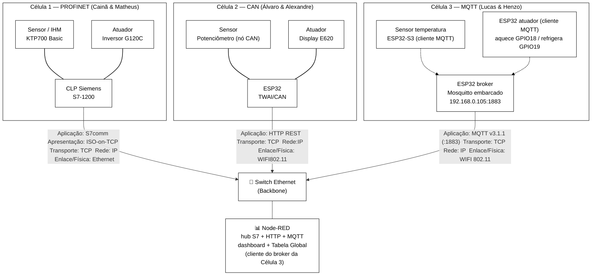

# 🛰️ NEXUS — Sistema de Automação de Multiredes

**Três células de produção de protoclos distintos, conectados através de um gateway especializado**

---

  
   
  Loop de 16s — sensor → rede → IHM → operador → atuador → feedback. Veja a leitura completa em <a href="#4-diagrama-de-blocos-geral-do-sistema">§4</a>.

---
Descrição da animação:

É possível visualizar nesta animação um exemplo de operação do NEXUS.
Ao iniciar o processo, é possível visualizar as 3 redes se comunicando com o dashboard no NodeRed via switch. Cada rede envia e recebe seus parametros passando por um switch. No dashbboard do computador do gateway é possível ver a temperatura do sensor da Célula 3 (MQTT). Onde é enviado um comando de aquecer, o comando é transportado pela rede até a Célula 3, liga o atuador e começa a aquecer a planta. O sensor envia o parâmetro de volta, e desativa o aquecimento ao chegar nas condições especificadas (O valor inicial de 18,2°C foi modificado para 21,4°C ao decorrer da execução).

## 1. Contexto

Projeto final da disciplina de **Comunicação de Dados** (IFSC — Departamento Acadêmico de Eletrônica). O objetivo é a **construção coletiva de um sistema de automação heterogêneo**: três duplas, três protocolos distintos, **uma única rede integrada**.

O critério central é a **interoperabilidade**: ao final, *o status de qualquer sensor da sala deve poder ser lido por qualquer célula, e qualquer atuador deve poder ser comandado, independentemente da rede em que esteja fisicamente conectado.*

| Item | Descrição |
|------|-------|
| Instituição | IFSC — Departamento Acadêmico de Eletrônica |
| Disciplina | Comunicação de Dados |
| Integrantes | Matheus e Cainã, Álvaro e Alexandre, Henzo e Lucas |
| Integração | Backbone Ethernet + Broker MQTT central (Node-RED) |

---

## 2. Descrição geral

O sistema é dividido em **três células de produção**, cada uma com três nós, construído por uma dupla e operando um **protocolo industrial diferente** na camada local. Cada nó é responsável por:

1. **Autonomia local** — ler o próprio sensor e comandar o próprio atuador *sem depender da rede externa*.
2. **Visibilidade global** — espelhar suas variáveis no gateway para que as outras células leiam/escrevam.

O Node-RED age como **hub multi-protocolo**: Implementado em todas as redes e no gateway, ele fala **S7/ISO-on-TCP** com o CLP (PROFINET), **HTTP REST** com o ESP32 da célula CAN, e **MQTT** com o ESP32 da célula MQTT. A "língua geral" não é um protocolo único no fio — é a **Tabela Global de Variáveis** consolidada dentro do Node-RED.

Tabela Global de váriaveis: Status do sensor, comando do atuador, diagnóstico online, o Node-RED mantém essas informções para traduzir entre PROFINET, CAN e MQTT e tornar qualquer sensor/atuador acessível por qualquer célula.

---

## 3. As três células (introdução)

| Dupla | Protocolo local | Controlador | Sensor | Atuador | Bridge p/ backbone |
|:-----:|:----------------|:------------|:-------|:--------|:-------------------|
| **1** — Cainã & Matheus | **PROFINET** | CLP Siemens S7‑121xC (`192.168.0.1`) | IHM KTP700 Basic | Inversor SINAMICS G120C | **S7 / ISO‑on‑TCP** (node‑red‑contrib‑s7) |
| **2** — Álvaro & Alexandre | **CAN** | ESP32 TWAI (`192.168.0.63`) | Potenciômetro (nó CAN substituto) | Display Dashboard E620 | **HTTP REST** (`/can`, `/set_nodered_*`) |
| **3** — Lucas & Henzo | **MQTT** | **ESP32 broker** — Mosquitto embarcado (`192.168.0.105:1883`) | Temperatura com **ESP32‑S3** (cliente MQTT) | Aquecimento + Refrigeração (GPIO18/19) com **ESP32 atuador** (cliente MQTT) | **MQTT** (Node‑RED como cliente do broker embarcado) |

Cada célula tem sua documentação completa, diagramas e código nas pastas abaixo.
*IP Fixo:* Foi utilizado um IP Fixo, para evitar conflito entre as redes e e para que os sensores/atuadores possam direcionar para apenas um IP em cada célula.
---

## 4. Diagrama de blocos geral do sistema

### Legenda do diagrama

| Símbolo | Descrição | Composição da Célula |
|--------|-------------|---------|
| Célula 1 | Rede PROFINET  | Sensor: IHM - Atuador: Inversora de Frequência |
| Célula 2 | Rede CAN | Sensor: Potenciômetro microcontrolado - Atuador: Display E620 |
| Célula 3 | Rede MQTT | Sensor: DS18B20(Temperatura) + Microcontrolador - Atuador: Carga resistiva para aquecimento e Ventilação para resfriamento |

---

## 5. Sumário / Navegação

- 📁 [**Backbone (Node-RED + Broker)**](./backbone/README.md) — switch, broker MQTT, dashboard, tabela global
- 📁 [**Rede PROFINET**](./rede-profinet/README.md) — Dupla 1
- 📁 [**Rede CAN**](./rede-can/README.md) — Dupla 2
- 📁 [**Rede MQTT**](./rede-mqtt/README.md) — Dupla 3

---

## 6. Equipe

| Dupla | Integrantes | Responsabilidade |
|:-----:|:------------|:-----------------|
| 1 | Cainã, Matheus | Rede PROFINET + **hospedagem do broker/Node-RED** |
| 2 | Álvaro, Alexandre | Rede CAN |
| 3 | Lucas, Henzo | Rede MQTT |

---

