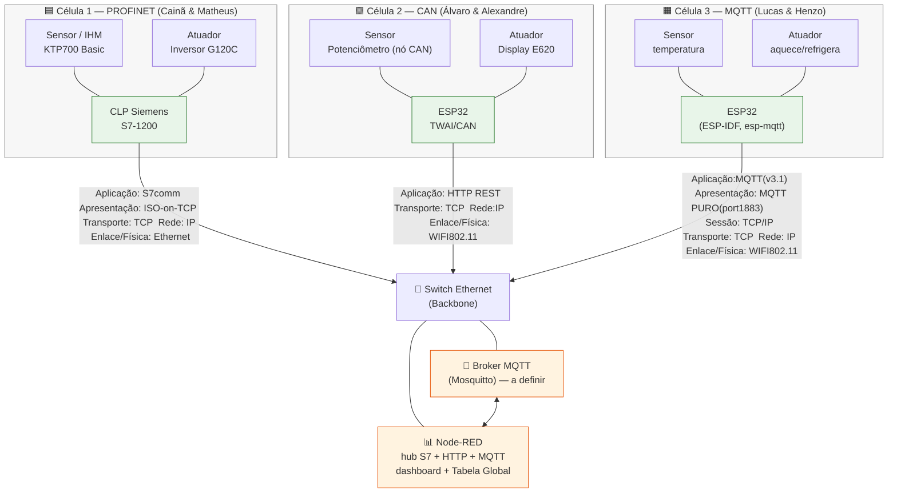

# 🛰️ NEXUS — Sistema de Automação de Multiredes

**Backbone Ethernet integrando três células de produção com protocolos industriais distintos**

---

  
   
  Loop de 16s — sensor → rede → IHM → operador → atuador → feedback. Veja a leitura completa em <a href="#4-diagrama-de-blocos-geral-do-sistema">§4</a>.

---

## 1. Contexto
---

teste
## 1. Contexto

Projeto final da disciplina de **Comunicação de Dados** (IFSC — Departamento Acadêmico de Eletrônica). O objetivo é a **construção coletiva de um sistema de automação heterogêneo**: três duplas, três protocolos distintos, **uma única rede integrada**.

O critério central é a **interoperabilidade**: ao final, *o status de qualquer sensor da sala deve poder ser lido por qualquer célula, e qualquer atuador deve poder ser comandado, independentemente da rede em que esteja fisicamente conectado.*

| Item | Descrição |
|------|-------|
| Instituição | IFSC — Departamento Acadêmico de Eletrônica |
| Disciplina | Comunicação de Dados |
| Integrantes | Matheus e Cainã, Álvaro e Alexandre, Henzo e Lucas |
| Integração | Backbone Ethernet + Broker MQTT central (Node-RED) |

---

## 2. Descrição geral

O sistema é dividido em **três células de produção**, cada uma com três nós, construído por uma dupla e operando um **protocolo industrial diferente** na camada local. Cada nó é responsável por:

1. **Autonomia local** — ler o próprio sensor e comandar o próprio atuador *sem depender da rede externa*.
2. **Visibilidade global** — espelhar suas variáveis no backbone para que as outras células leiam/escrevam.

O Node-RED age como **hub multi-protocolo**: fala **S7/ISO-on-TCP** com o CLP (PROFINET), **HTTP REST** com o ESP32 da célula CAN, e **MQTT** com o ESP32 da célula MQTT. A "língua geral" não é um protocolo único no fio — é a **Tabela Global de Variáveis** consolidada dentro do Node-RED, que será apresentado mais a frente.

---

## 3. As três células (introdução)

| Dupla | Protocolo local | Controlador | Sensor | Atuador | Bridge p/ backbone |
|:-----:|:----------------|:------------|:-------|:--------|:-------------------|
| **1** — Cainã & Matheus | **PROFINET** | CLP Siemens S7‑121xC (`192.168.0.1`) | IHM KTP700 Basic | Inversor SINAMICS G120C | **S7 / ISO‑on‑TCP** (node‑red‑contrib‑s7) |
| **2** — Álvaro & Alexandre | **CAN** | ESP32 TWAI (`192.168.0.63`) | Potenciômetro (nó CAN substituto) | Display Dashboard E620 | **HTTP REST** (`/can`, `/set_nodered_*`) |
| **3** — Lucas & Henzo | **MQTT** | PC com Mosquitto | Sensor de temperatura com ESP32S3 | Aquecimento + Refrigeração (GPIO18/19) com ESP32S3 | **MQTT** (`esp-mqtt`) |

Cada célula tem sua documentação completa, diagramas e código nas pastas abaixo.

---

## 4. Diagrama de blocos geral do sistema

### Legenda do diagrama

| Símbolo | Significado |
|--------|-------------|
| 🟩 Nós **verdes** (`PLC`, `ESP2`, `ESP3`) | **Controladores locais.** É aqui que roda o *algoritmo de controle autônomo* de cada célula. |
| 🟧 Nós **laranja** (`Node-RED`, `Broker`) | **Nível central (o PC).** Roda *apenas* agregação, monitoramento, Tabela Global e *override* — **não** roda a malha de controle das células. |
| 🔀 `Switch` | Domínio de comutação do backbone Ethernet (full-duplex, sem colisão entre portas). |
| Rótulo das setas | Pilha de protocolos **camada por camada** (mapeamento OSI) que cada célula usa para subir ao backbone. |

 - **A malha de controle de cada célula roda no próprio controlador local** (o nó verde): o CLP S7-1200 fecha a malha do inversor; o ESP32 CAN trata o nó CAN; o ESP32 MQTT decide `aquecer/refrigerar/desligar`. Isso satisfaz o critério **Autonomia da Célula** — a célula continua operando *mesmo se o backbone cair*.
 - **O PC (Node-RED + broker, nós laranja) NÃO fecha malha de controle.** Ele só (a) **lê** as variáveis espelhadas de todas as células, (b) mantém a **Tabela Global de Variáveis** como ponto único de tradução entre os três protocolos, e (c) permite **override manual** pelo dashboard. Se o PC for desligado, cada célula continua controlando seu processo localmente — perde-se apenas a *visibilidade global* e o *override* (controle de cada célula).

---

## 5. Sumário / Navegação

- 📁 [**Backbone (Node-RED + Broker)**](./backbone/README.md) — switch, broker MQTT, dashboard, tabela global
- 📁 [**Rede PROFINET**](./rede-profinet/README.md) — Dupla 1
- 📁 [**Rede CAN**](./rede-can/README.md) — Dupla 2
- 📁 [**Rede MQTT**](./rede-mqtt/README.md) — Dupla 3

### 📈 Resultados 
- 📄 [Resultados (tempo, perda de pacotes, jitter, throughput)](docs/resultados.md)
- 📄 [Referências e links úteis](docs/referencias.md)

---

## 6. Equipe

| Dupla | Integrantes | Responsabilidade |
|:-----:|:------------|:-----------------|
| 1 | Cainã, Matheus | Rede PROFINET + **hospedagem do broker/Node-RED** |
| 2 | Álvaro, Alexandre | Rede CAN |
| 3 | Lucas, Henzo | Rede MQTT |

---

## 7. Licença

Distribuído sob a licença [MIT](LICENSE).
