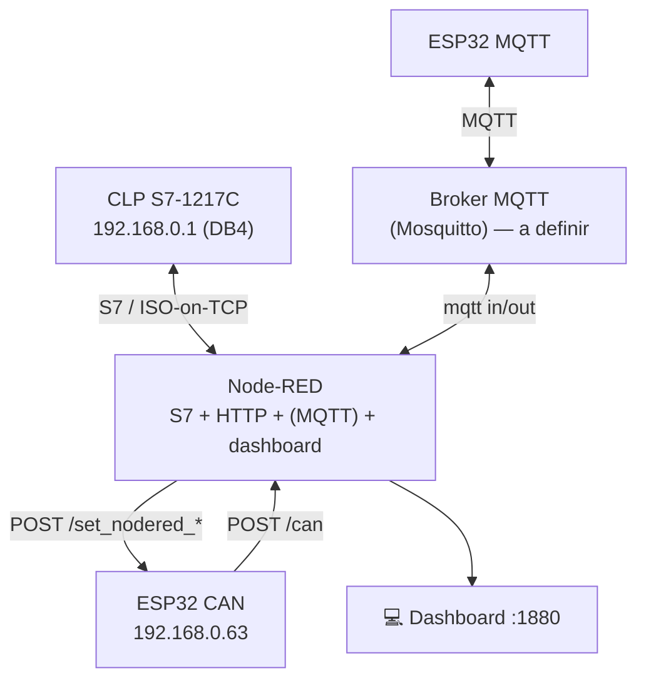

# 🌐 Backbone — Integração (Node-RED como hub multi-protocolo)

[](https://nodered.org/)
[](#)
[](#)
[](#)

O backbone é o núcleo central de alta capacidade da rede (sua "espinha dorsal"), cuja função é agregar, rotear e escoar volumes de tráfego de dados entre diversas sub-redes menores, provedores regionais e data centers, garantindo a conectividade de longa distância e a resiliência de toda a topologia. Em nosso projeto usamos o **Node-red**, como  backbone, sendo ele responsavel pelo gerenciamento e fluxo de dados dos nossos dispositivos.

# O que é o Node-red - https://nodered.org/

O Node-RED é uma ferramenta de desenvolvimento de código aberto focada na programação baseada em fluxos (Flow-Based Programming), originalmente criada pela IBM para simplificar a interconexão de dispositivos de hardware, APIs e serviços online no ecossistema da Internet das Coisas (IoT). Através de uma interface gráfica executada diretamente no navegador, os usuários podem arrastar, soltar e interligar blocos funcionais chamados de "nós", o que reduz drasticamente a necessidade de codificação manual complexa para estabelecer fluxos de dados automatizados.

A base estrutural do Node-RED repousa sobre o conceito de nós de entrada, processamento e saída, onde cada nó executa uma tarefa atômica e se comunica enviando mensagens padronizadas na forma de objetos JSON (JavaScript Object Notation). Toda a lógica visual construída pelo usuário, incluindo a disposição e o encadeamento desses nós, é convertida e salva nativamente em arquivos JSON de texto limpo, o que confere à plataforma uma extrema leveza, portabilidade e facilidade para exportação, importação e controle de versão de projetos de automação.

Por baixo dessa interface visual, o Node-RED roda inteiramente sobre o Node.js, um ambiente de execução (runtime) JavaScript assíncrono e orientado a eventos, construído sobre o motor V8 do Google Chrome. A arquitetura de I/O (Entrada/Saída) não-bloqueante do Node.js permite que o Node-RED gerencie milhares de conexões e eventos simultâneos em tempo real com um consumo mínimo de memória e CPU, tornando-o altamente eficiente tanto para servidores robustos em nuvem quanto para gateways industriais de recursos limitados e sistemas embarcados.

Na comunicação entre equipamentos distintos, o Node-RED atua como um middleware ou gateway inteligente, realizando a ingestão multiprotocolo de dados provenientes de hardwares que utilizam linguagens incompatíveis, como MQTT, Modbus, HTTP ou comunicação Serial. Após capturar esses dados brutos, a ferramenta realiza o parsing e a normalização das informações em tempo real e as roteia para seus respectivos destinos — sejam eles bancos de dados, painéis de monitoramento ou comandos de controle enviados de volta para dispositivos

## 1. Node-red no Projeto NEXUS


### Conexão PROFINET (CLP)
- **S7 endpoint** `S71217C` em `192.168.0.1` (rack 0 / slot 1, ISO-on-TCP, cycletime 1000 ms).
- Variáveis no **DB4** (controle do inversor SINAMICS):

| Nome | Endereço | Tipo | Uso |
|------|----------|------|-----|
| `START` | `DB4.DBX0.0` | bool | Liga o inversor |
| `STOP` | `DB4.DBX.0.1` ⚠️ | bool | Para o inversor |
| `ENTRADA_REF_FREQUENCIA` | `DB4.DBD10` | dword/real | Referência de frequência (setpoint) |
| `FBK_REF_FREQUENCIA` | `DB4.DBD14` | dword/real | Feedback de frequência |

> ⚠️ **Bug provável:** o endereço de `STOP` está escrito **`DB4.DBX.0.1`** (ponto a mais). O correto é **`DB4.DBX0.1`**. Do jeito que está, o nó S7 não resolve o endereço.

### Integração CAN (HTTP)
- `POST /can` → recebe dados do ESP32 CAN.
- `POST /toggle` → liga/desliga o inversor (botões Liga/Desliga do dashboard).
- `POST /slider` → ajuste de frequência/velocidade.
- `http request` → envia para o ESP32 CAN (`192.168.0.63`): `/set_nodered_freq`, `/set_nodered_value`.

### Dashboard (node-red-dashboard)
- Páginas: **Home**, **CLP**, **CAN**.
- Widgets: LED "Inversor Liga/Desliga Via Esp32", gauge **Km/h** (0–100), sliders de velocidade/frequência (0–60 e 0–100), botões **Liga/Desliga**.

## 2. `flows-web-bridge.json` (HTTP MCU ⇄ Web)

Flow de referência que serve uma página em `GET /site` e expõe:
- `GET /api/state` (estado atual: temperatura, umidade, luz, atuador),
- `POST /api/actuator` (site comanda atuador),
- `POST /api/mcu/sensor` (MCU envia sensor e recebe o comando na mesma resposta).

Útil como **template de integração HTTP** e como página web exigida ("comunicar com o website online").

---

## 3. Diagrama de integração (real)



---

## 4. Conteúdo desta pasta

```text
backbone/
├── README.md
├── node-red/
│   ├── flows-backbone.json     ← S7 (PROFINET) + HTTP (CAN) + dashboard
│   └── flows-web-bridge.json   ← demo HTTP MCU ⇄ Web
├── diagramas/
├── componentes/
└── figs/
```

> ⚠️ **Segurança:** revise os flows antes de commitar — remova IPs sensíveis se necessário e **nunca** versione senhas de broker.
