# Website - online (Álvaro)

---

## 1	Descrição do projeto

Para disponibilizar os resultados obtidos do Node central sem depender de um dashboard local foi construído um site capaz de requisitar os dados localmente para a porta de onde o `Node-RED` central está rodando, salvá-los em um banco de dados e disponibilizá-los em um website para qualquer indivíduo que acesse o domínio na internet, seja pelo computador ou pelo celular.

 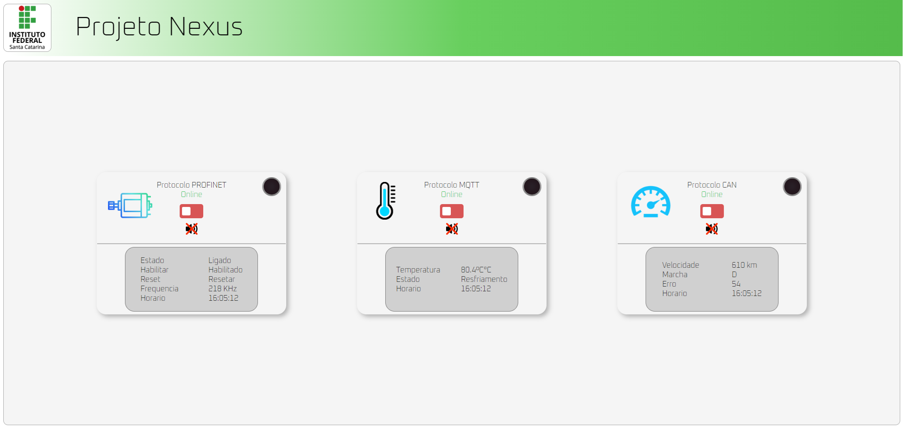

<b>Website</b>

  

## 2	Funcionamento

o website possui duas entradas, a geral e a local. A entrada geral é aquela que é acessado como qualquer site, a partir de sua url pura, por exemplo exemplo: www.google.com. O website funciona de modo em que as instruções da sua configuração `.htacess` do servidor retornem para o usuario, a partil da URL dada, qualquer arquivo que se encaixe no padrão de nome configurado, sendo o mais comum `index`, como na figura abaixo. Deste modo o dashboard online para o publico geral presente no arquivo `index.php` será sempre disponibilizada se não houver especificação do arquivo na URL, enquanto a URL de upload precisa ser especificada. O arquivo `index.php` apesar de ter a extensão .php admite em seu arquivo código html e javascript, portanto quando o host retornar a pagina presente no mesmo, o javascript irá começar a executar queries (requisições ao banco de dados) periodicamente através de uma função `setInterval()` que é chamada dentro da própria função `get_data()` cada vez que a requisição da query é finalizada, tendo ela sido recebida ou não. O intervalo de tempo pode ser ajustado para aquele que o desenvolvedor achar necessario, o tempo atual é de 3 segundos pois estavamos receoso que durante os testes as milhares de requisições acumuladas iriam fazer o host travar o website. Esse problema foi. de uma certa forma, contornado através de uma função que escuta pela mudança do estado `"visibilitychange"`, assim quando a aba do website não estiver em foco as requisções são cessadas até que o usuario volte ao website e as requisições retornam a ser realizadas.
 

 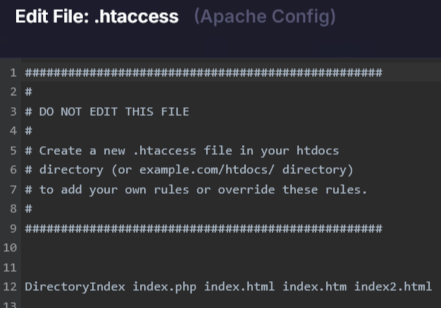

<b>Configuração .htacess do servidor PHP local Apache</b>

  

A segunda entrada é a de upload de dados. Através de um sistema de armazernamento similar ao de diretorios é possivel acessar diferentes arquivos dentro da pasta `htdocs` (Hyper Text Documents) através da URL, pasta que contem todos os arquivos de seu website. Portanto selecionando a URL + `/arquivo`, podemos entrar na pagina de upload de dados ao banco de dados do servidor. O arquivo `/upload.php` tamém possui códigos html e javascript, e o código javascript realiza requisições periodicamente, através de uma função setInterval() dentro da função set_data(), HTTP ao IP de loopback `127.0.0.1`, conhecido como localhost, o qual é o endereço do próprio computador, e salva o objeto JSON no banco de dados se ele for retornado. Deste modo é possível fazer requisições as portas do próprio computador em que o website for acessado e acessar a porta 1880, porta padrão por onde o Node-RED estará rodando e disponibilizando os dados em tempo real. Se o Node-RED vir a fechar, travar ou reiniciar, o Node sempre realizará um "ultimo suspiro" e retornará o objeto padrão com todos os campos zerados ou falso. O IP `127.0.0.1`, porta `1880` e diretorio `/api/state` podem vir a ser mudados a depender das necessidades do projetista. A sincronização ocorre somente enquanto a página upload.php estiver aberta no mesmo computador que executa o Node-RED. Diferentemente de index.php, essa página não interrompe intencionalmente as requisições quando a aba perde o foco, permitindo que o desenvolvedor utilize outras abas enquanto os dados continuam sendo enviados ao banco. Entretanto, o navegador pode reduzir a frequência de execução dos temporizadores em abas que permanecem em segundo plano, de modo que a periodicidade configurada não é garantida nessas condições.

Ambos arquivos `index.php` e `upload.php` realizam requisições javascript por metodos **POST** ao arquivo `controller.php` que  checa a ação a ser tomada, e direciona devidamente, através de um swich(), os metodos a serem chamados pelo arquivo `backend.php` que está importado no mesmo.

 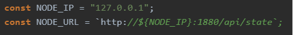

<b>Endereço da requisição http</b>

 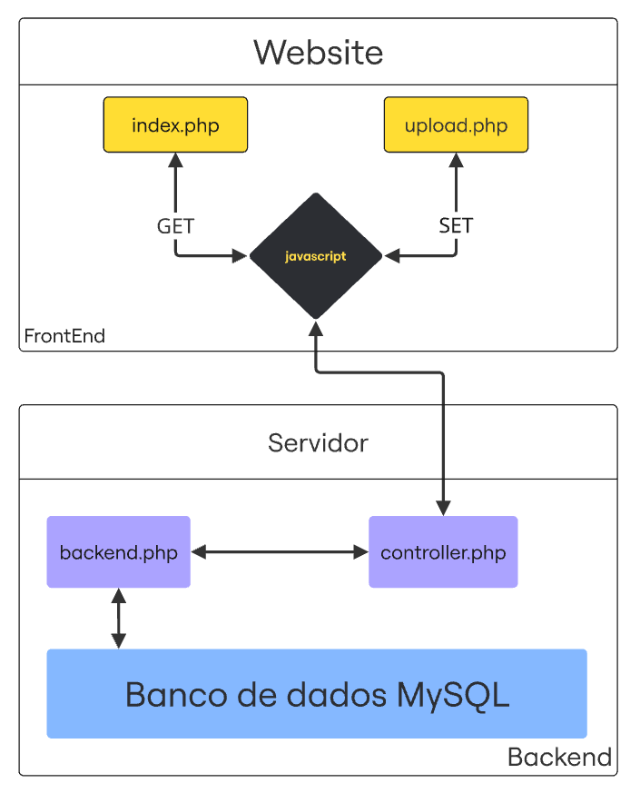

<b>Fluxograma do website</b>

  

## 3	Estrutura de dados

### Estrutura de arquivos do Website

Resumo geral dos arquivos e suas funcionalidades.

| Arquivo | Descrição |
| :---: | :--- |
| `index.php` | Disponibiliza um dashboard online através de requisições periodicas ao banco de dados do host. |
| `upload.php` | Quando setado corretamente, fará o upload dos dados ao banco de dados do host. |
| `controller.php` | Arquivo responsavel por gerenciar as ações ao banco de dados.  |
| `backend.php` | Arquivo que contem classes responsaveis por conectar-se e realizar queries ao banco de dados. |
| `estilo.css` | Arquivo responsavel por formatar a configuração estética HTML do website. |
| `/imagens` | Pasta que contem as imagens, icones, gifs, audio, etc, utilizados pelo website. |

### Definições das Linguagens e arquivos utilizadas.

`HTML` : Responsavel por criar a estrutura do website, quando o navegador recebe o código HTML ele cria uma arvore de documentos/objetos). 
`CSS` : Formata a configuração padrão de objetos HTML. 
`javascript` : Linguagem de responsavel pelo tornar o website responsive, desde alterar icones/css até realizar requisições htttp.  
`PHP` : linguagem de server-side, utilizadas pelos servidores. Suporta HTML e Javascript em seu arquivo. Todo código php fica invisivel ao usuario, diferente do html e javascript 
`MySQL` : Estrura semantica lida por banco de dados para realizar diversas ações no mesmo. 

## 4  Configuração Node-Red

Para que Node-RED responda as requisições foi criado funções em paralelo com o código do Node-RED central para extrair dados do fluxo de comunicação e salva-las em um objeto armazenado no contexto do próprio Node-RED (`contextStorage`) no computador que está o executando. O escopo flow permite que os nós pertencentes ao mesmo fluxo compartilhem o valor. O estado do objeto consolidado é armazenado no contexto flow do Node-RED mantido na memória RAM. Quando o Node-RED é fechado ou reiniciado, o conteúdo desaparece. O `contextStorage` é uma configuração do arquivo settings.js que permite mudar esse comportamento. Mas é possivel configurar o Node-RED para mudar o comportamento do `contextStorage`  no `setting.js`

### Função principal Requisição GET `/api/state`

<table>
  <tr>
    <td>
      <pre><code class="language-js">
      Return current object state on http request
      </code></pre>
      
          const defaultState = {
            deviceID: "NEXUS Central Node V2",
        
            PROFINET: {
                online: true,
                frequencia: 0,
                estado: false,
                habilitar: false,
                resetar: false
            },
            CAN: {
                online: true,
                velocidade: 0,
                marcha: 0,
                erro: 0
            },
            MQTT: {
                online: true,
                temperatura: "---",
                estado: "---"
            }
        };
      
        const saved = flow.get("protocolState") || {};
        const response = {
            deviceID: saved.deviceID || defaultState.deviceID,
            PROFINET: {
                ...defaultState.PROFINET,
                ...(saved.PROFINET || {})
            },
            CAN: {
                ...defaultState.CAN,
                ...(saved.CAN || {})
            },
            MQTT: {
                ...defaultState.MQTT,
                ...(saved.MQTT || {})
            }
        };
        
        msg.headers = {
            "Content-Type": "application/json",
            "Access-Control-Allow-Origin": "https://curricularium.infinityfreeapp.com"
        };
        
        msg.payload = JSON.stringify(response);        
        return msg;
        
  </td>
  </tr>
</table>

 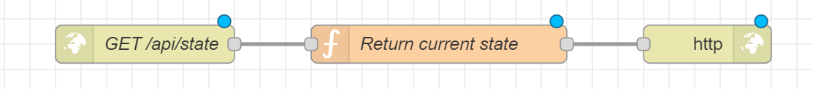

  

### set PROFINET state
<table>
  <tr>
    <td>
      <pre><code class="language-js">
      Save PROFINET state object        
      </code></pre>
      
        const protocolState = flow.get("protocolState") || {};

        protocolState.PROFINET = {
            ...(protocolState.PROFINET || {}),
            online: true,
            frequencia: Number(msg.payload ?? 0)
        };      
        flow.set("protocolState", protocolState);      
        return msg;         
  </tr>
</table>

 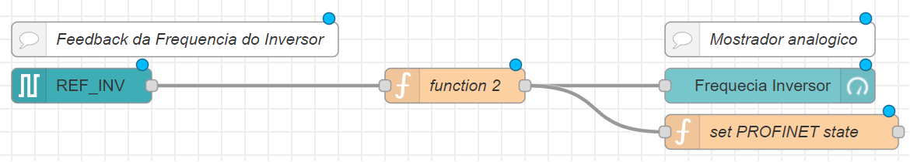

  

### set CAN state
<table>
  <tr>
    <td>
      <pre><code class="language-js">
      Save CAN state object
      </code></pre>
      
        let body = msg.payload;

        if (typeof body === "string") {
            try {
                body = JSON.parse(body);
            } catch (err) {
                node.warn("Invalid CAN JSON");
                return msg;
            }
        }
        
        const can = body.adc && typeof body.adc === "object"
            ? body.adc
            : body;
        
        const protocolState = flow.get("protocolState") || {};
        
        protocolState.CAN = {
            online: true,
            velocidade: Number(can.velocidade ?? can.velocity ?? protocolState.CAN?.velocidade ?? 0),
            marcha:     Number(can.marcha ?? can.gear ?? protocolState.CAN?.marcha ?? 0),
            erro:       Number(can.erro ?? can.error ?? protocolState.CAN?.erro ?? 0)
        };
        
        flow.set("protocolState", protocolState);        
        return msg;
         
  </tr>
</table>

 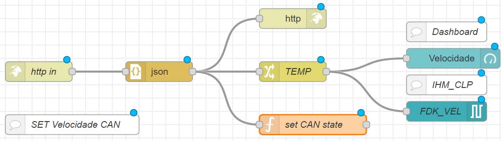

  

### set MQTT state temperatura
<table>
  <tr>
    <td>
      <pre><code class="language-js">
      Save MQTT state object
      </code></pre>
      
        const protocolState = flow.get("protocolState") || {};

        protocolState.MQTT = {
            ...(protocolState.MQTT || {}),
            online: true,
            temperatura: Number(msg.payload)
        };
        
        flow.set("protocolState", protocolState);        
        return msg;        
  </tr>
</table>

### set MQTT state estado
<table>
  <tr>
    <td>
      <pre><code class="language-js">
      Save PROFINET state object
      </code></pre>
      
        const protocolState = flow.get("protocolState") || {};

        protocolState.MQTT = {
            ...(protocolState.MQTT || {}),
            online: true,
            estado: String(msg.payload)
        };
        
        flow.set("protocolState", protocolState);
        return msg;      
  </tr>
</table>

 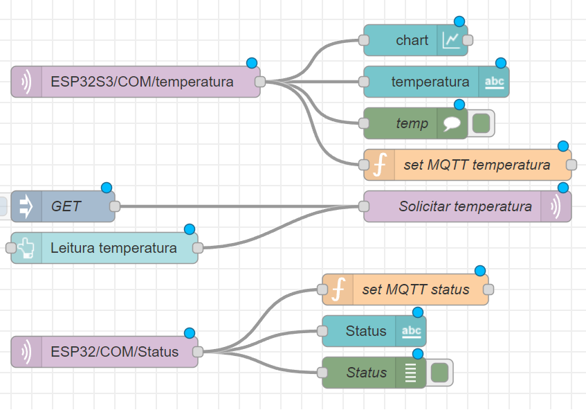

  

### objeto JSON esperado no Website
<table>
  <tr>
    <td>
      <pre><code class="language-js">
      JSON object
      </code></pre>
      
      {
        "deviceID": "Nexus_Hub",
        "PROFINET": {
          "online": true,
          "estado": false,
          "habilitar": false,
          "resetar": false,
          "frequencia": 0
        },
        "CAN": {
          "online": true,
          "velocidade": 0,
          "marcha": 0,
          "erro": 0
        },
        "MQTT": {
          "online": true,
          "temperatura": "---",
          "estado": "---"
        }
      }       
  </tr>
</table>

### Politica de segurança do browser

A CORS (Cross Origin Resource Sharing) é um mecanismo de segurança do browser que bloqueia código Javascript de frontend de ler respostas de diferentes origens a não ser que seja explicitamente habilitado pelo servidor. Dependendo do computador e de sua configuração a falta desta explicidade pode gerar um bloqueio, e consequente erro, impossibilitando a comunicação entre o Website e o Node-RED. Portanto, dentro do parametro `origin` do objeto `httpNodeCors` no arquivo setting.js do Node-RED, presente no diretorio `(usuario)/.node-red` do seu computador, o desenvolvedor deve colocar o endereço completo do website que irá utilizar, protocolo (HTTP/HTTPS) + dominio. Note que mesmo que o website que realiza o upload e acessa o localhost possui o diretório `/upload`, ele não entra como endereço, apenas o endereço absoluto.

<table>
  <tr>
    <td>
      <pre><code class="language-js">
        CORs policy Node-RED setting.js configuration
      </code></pre>
      
      httpNodeCors: {
          origin: "https://curricularium.infinityfreeapp.com",
          methods: "GET,POST,OPTIONS",
          allowedHeaders: ["Content-Type"]
      }
        
  </tr>
</table>

## 5	configurações para futuros semestres

Este website é uma solução simples para um problema que tende a uma alta complexidade na industria de software, isto é, devido a situação academica do projeto não haverá muitos usuarios se não aqueles que estão ativamente coordenando ou desenvolvendo o projeto, não há segurança pois não há usuarios maliciosos, diversos problemas que ocorrem com baixa frequencia foram descartados ou adiados. Foi realizado esforço para lidar com diversas adversidades, desde o banco de dados do host não responder até ao website `index.php` que muda icones, textos e audios quando um protocolo desconecta. e cujas funções podem vir a serem transcritos a pagina `upload.php`.

Como o website está situado em um servidor de uma conta privada de um aluno, a existencia futura do website e do dominio é incerta. Para utilizar e dar continuidade a está raiz do projeto será necessario criar um novo website. para isto você poderá utilizar o mesmo host de website utilizado neste projeto, o InfinityFree. Após criar uma nova conta e escolher um nome para o dominio você terá um novo website e pderá acessar a pagina de configuração.

 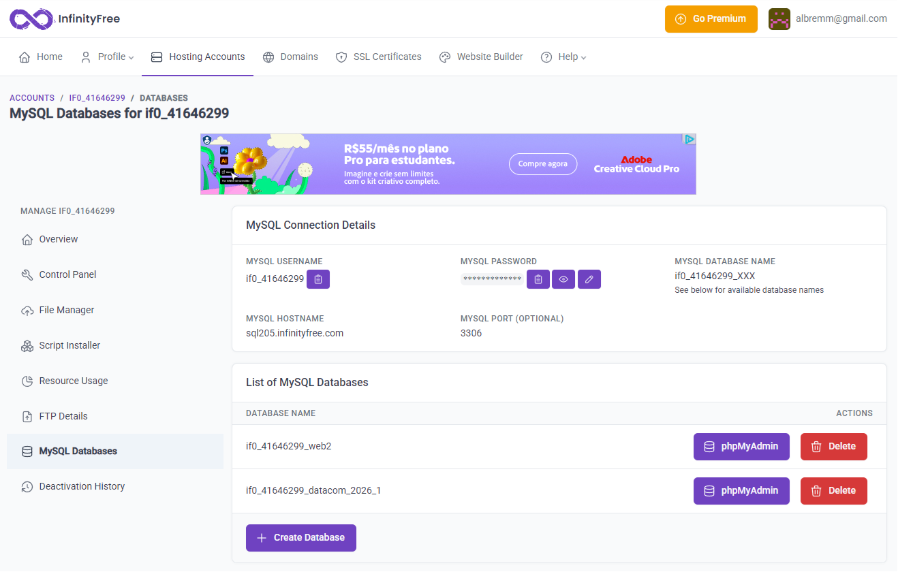

<b>Pagina de configuração</b>

### Descrição geral dos arquivos
Resumo geral dos arquivos e suas funcionalidades.

| opção | Descrição |
| :---: | :--- |
| `Overview` | Dados gerais do website. |
| `file manager` | local para armazenar e atualizar os arquivos do website dentro da pasta `htdocs`. |
| `MySQL Databases` | Gerenciador de banco de dados MySQL onde seus dados serão criados/atualizados. |
| `resource Usage` | Aba de uso de recursos do website. Cuidado para não ultrapassar os 50000 hits, que significa requisitar os **arquivos** ao host, Atualizar o website não requisita os arquivos novamente mas CTRL + F5 e abri-lo em uma nova aba requisitam. |
| `Control Panel` | Configurações gerais do website. |

### Banco de dados
Será necessario criar e acessar o banco de dados em seu novo website. No arquivo `backend.php` existe a classe `Connection` responsavel por realisar a conexão ao banco de dados, ele utiliza os parametros host, dbname, user e password que são auto explicativos. O desenvolvedor deverá colocar os dados do seu banco de dados no arquivo para que a comunicação com a "nuvem" aconteça.

 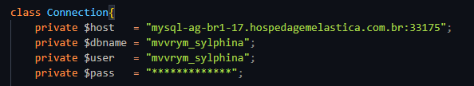

<b>Conexão de banco de dados</b>

  

Esses dados são obtidos na aba `MySQL Databases` apresentadas na tabela logo acima.

 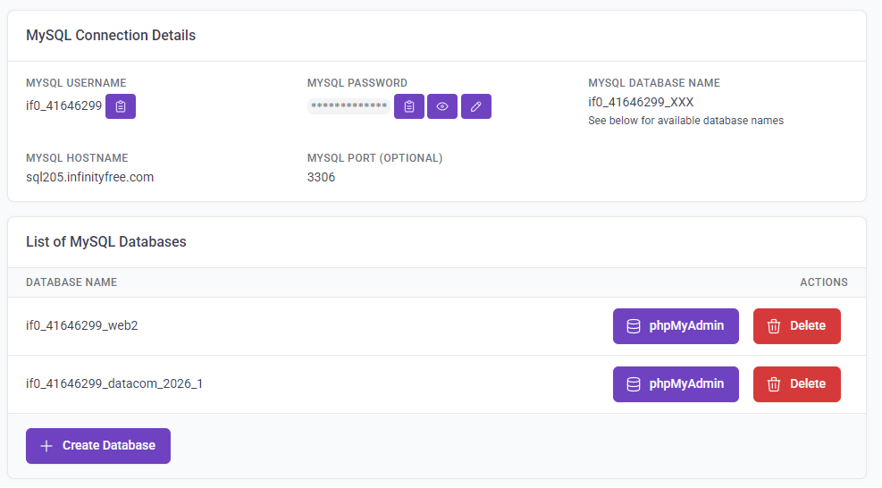

<b>Detalhes da base de dados</b>

  

Com Esses parametros configurados você poderá acessar o banco de dados a partir do website e configurar tabela e coluna necessarias para o projeto. Se a necessidade de projetos futuros fortem similares ao do website deste semestre, 2026/1, é possivel importar as configurações do banco de dados pelo MyPHPadmin utilizando o arquivo `database_export.sql`.

Uma possivel alteração futura para esta raiz do projeto seria tornar o website completamente independente do Node central, de modo que o Node, ou um segundo website local, envie e receba  requisições através de IP's ou dominios, realizando uma troca de dados mais dinamica com o website. Esta topologia não é melhor ou pior, deve ser levado em conta as necessidades gerais do projeto.

Não houve tempo para checar se o protocolo está online no flow do Node-RED central e salva-lo no objeto que vai para o Website. Contudo, o website é versátil neste quesito e sinaliza através de icones, texto, cores e até sinal de audio, quando o botão estiver ativo, para retratar visualmente o estado da conexão do protocolo. Contudo, esse não foi um problema demasiado grande pois se tudo estiver funcionando raramente haverá a necessidade desta verificação ocorrer. Mas que fique documentado e em mente para proximo semestres que está opção já está programada no site (index.php), só requer que o Node-RED central atualize o estado online do protocolo.

