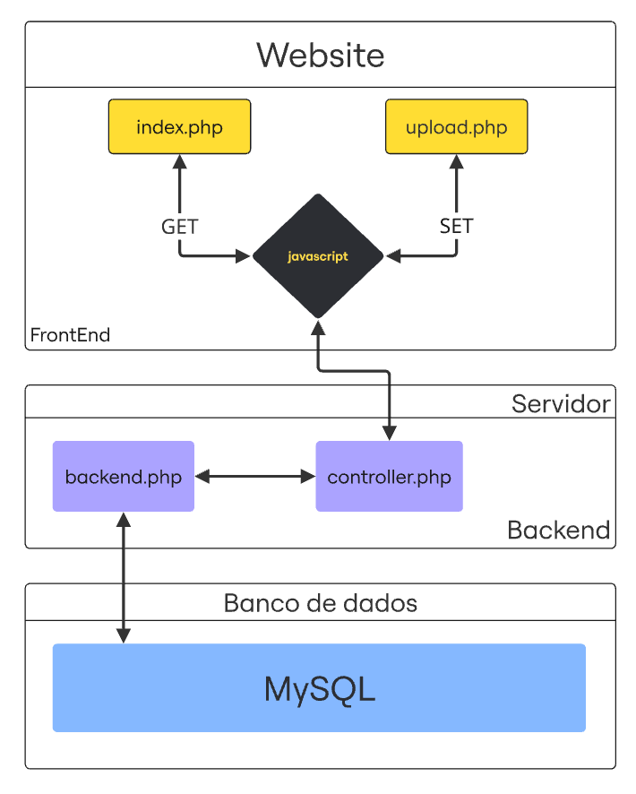

# 🟥 Website - online (Álvaro)

---

## 1. Descrição do projeto

Para disponibilizar os resultados obtidos sem depender de um dashboard local foi construído um site capaz de requisitar os dados para a porta de onde o `Node-RED` central está trabalhando, salvá-los em um banco de dados e disponibilizá-los para qualquer indivíduo que acesse o domínio online, seja pelo computador ou pelo celular.

o website possui duas entradas, a geral e a local, a geral tem a função de disponibilizar os dados para o público geral, esses dados são requisitado em javascript em método post para um arquivo backend em php que rodará no servidor, onde está localizado o banco de dados,

 

<b>Fluxograma do website</b>

  

O grande objetivo desta célula é ler de maneira contínua os dados de um sensor analógico (potenciômetro) mapeado sob o identificador exclusivo CAN `, processar os pacotes para o cálculo de velocidade real em km/h e comandar um painel atuador de indicadores (Painel E620) via ID CAN `0x4D2`. O Gateway ESP32 também atua como **ponte** para o backbone (Node-RED) por meio de requisições assíncronas **HTTP (POST/GET)** em formato de texto puro (`text/plain`) e JSON. A grande vantagem desse design é garantir a operação offline e robusta da rede de campo CAN, enquanto permite a convergência com o sistema supervisório centralizado.

### Variáveis Disponíveis ao Node-RED / Servidor HTTP
.

## 2. Estrutura de dados

Ao inserir o link do site sem indicar o arquivo, do mesmo modo que qualquer outro site, o servidor hospedado procura automaticamente por um arquivo de nome index e quaisquer variações de extensão. Esse arquivo index.php é responsável por disponibilizar os dados do banco de dados do servidor hospedado ao usuári oem contraste ao upload.php que é responsavel pelo upload dos dados ao banco de dados do servidor.

Deste modo sempre que um usuario entrar com a url do site ele será direcionado

 

<b>Fluxograma</b>

  

Para inserir os dados é necessário adicionar o diretório “/upload.php” a url do site de modo a ficar:  https://curricularium.infinityfreeapp.com/upload.php ou somente curricularium.infinityfreeapp.com/upload.php, pois o navegador completa a pesquisa na web. 
	No arquivo upload.php existe um código que faz uma requisição ao ip do próprio pc utilizando o ip de loopback 127.0.0.1, conhecido como localhost, é o endereço do próprio computador. Deste modo é possível fazer requisições as portas do próprio computador e acessar a porta 1800, porta padrão por onde o Node-RED estará rodando e disponibilizando os dados os quais serão requisitados: http://127.0.0.1:1880/api/state.

### Estrutura de envio de dados

Descrição geral das configurações das variaveis.

| Arquivo | Descrição |
| :---: | :--- |
| `index.php` | Disponibiliza um dashboard online através de requisições periodicas, geridas pelo arquivo controller.php, ao banco de dados do host. |
| `upload.php` | Quando setado corretamente, fará o upload dos dados, geridas pelo arquivo controller.php, ao banco de dados do host. |
| `controller.php` | Arquivo o qual decide que ações tomar a depender da requisição mandada para o mesmo.  |
| `backend.php` | Arquivo que contem classes responsaveis por conectar-se ao banco de dados do host e para realizar query ao banco de dados. |
| `estilo.css` | Arquivo responsavel por formatar a estética HTML do website. |
| `/imagens` | Pasta que contem as imagens, icones, gifs, audio, etc, utilizados pelo website. |

### Definições das Linguagens e arquivos utilizadas.

`HTML` : Responsavel por criar a estrutura do website, quando o navegador recebe o código HTML ele cria uma arvore de documentos/objetos). 
`CSS` : Formata a configuração padrão de objetos HTML. 
`javascript` : Linguagem de alto nivel responsavel pelo  
`PHP` : linguagem de backend. 
`MySQL` : Estrura semantica lida por banco de dados para realizar diversas ações. 

