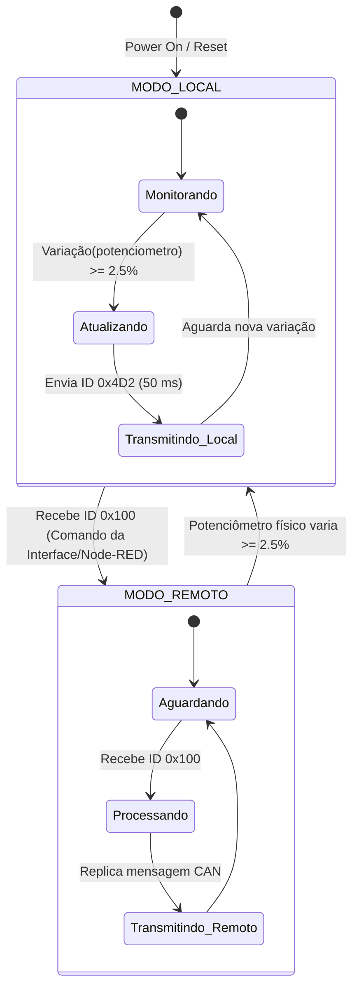
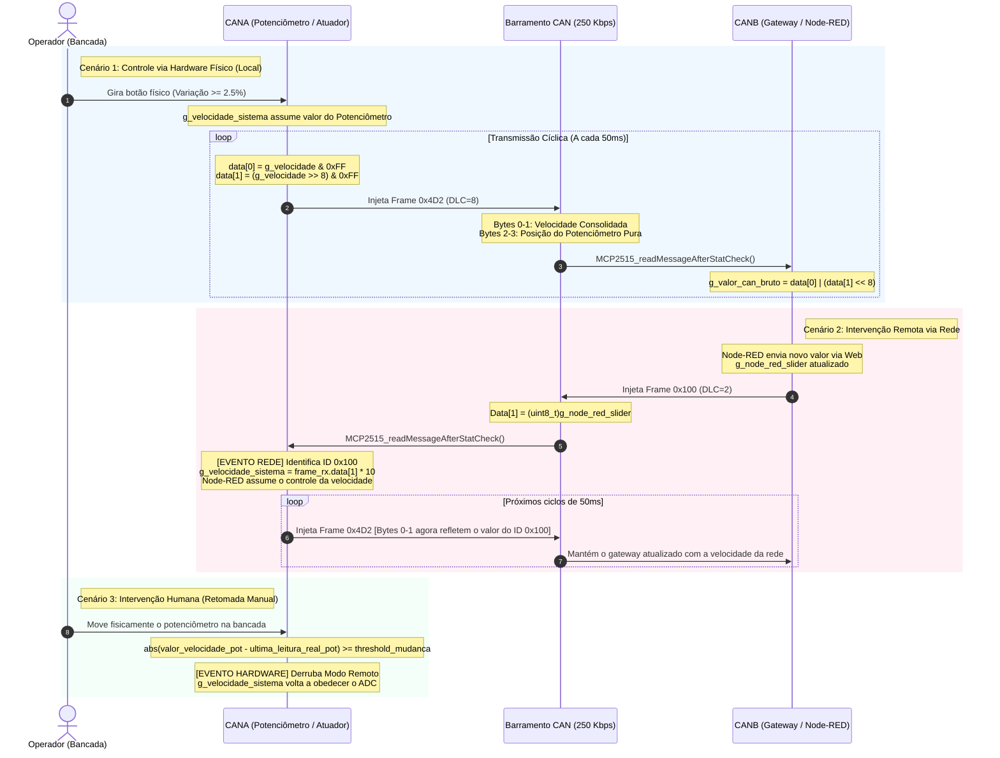

#  Rede CAN — Célula 2 (Alexandre & Alvaro)

## 1. Descrição do projeto

O protocolo local utilizado nesta célula é o **CAN (Controller Area Network)** operando a uma taxa de barramento industrial de **250 Kbps**. A rede é composta por microcontroladores **ESP32** acoplados a controladores autônomos **MCP2515** via interface de periféricos serial (**SPI**). O ESP32 principal atua como o nó mestre/gateway local da bancada, coletando os sinais do barramento e disponibilizando uma interface gráfica de monitoramento por meio de um Web Server HTTP nativo. 

O objetivo desta célula é ler de maneira contínua os dados de um sensor analógico (potenciômetro + sistema microcontrolado) mapeado sob o identificador exclusivo CAN, processar os pacotes para o cálculo de velocidade real em km/h e comandar um painel atuador de indicadores (Painel E620) via ID CAN `0x4D2`. O Gateway ESP32 também atua como **ponte** para o gateway global (Node-RED) por meio de requisições assíncronas **HTTP (POST/GET)** em formato de texto puro (`text/plain`) e JSON. 

### Variáveis Disponíveis ao Node-RED / Servidor HTTP

| Nome / Recurso | Rota / Endpoint | Método HTTP | Tipo no Node-RED | Uso / Formato de Origem |
| :--- | :--- | :---: | :--- | :--- |
| `g_valor_can_bruto` | `/data` | **GET** | `Number` (via JSON) | Valor decimal bruto consolidado do sistema (origem bytes [0] e [1] do frame `0x4D2`). |
| `g_velocidade` | `/data` | **GET** | `Number` (via JSON) | Velocidade calculada e escalonada em km/h (`g_valor_can_bruto / 10.0f`). |
| `g_pot_hardware_bruto` | `/data` / Envio automático | **GET** / **POST** | `Number` (JSON) | Enviado ativamente para o Node-RED na rota `/can` como `tensao` calculada (0.00 a 3.30V). |
| `g_slider_value` | `/set_slider` | **POST** | `String` (Texto Puro) | Posição modificada no Slider da página HTML local. O ESP32 repassa ao Node-RED em `/slider`. |
| `g_node_red_slider` | `/set_nodered_value` | **POST** | `String` (Texto Puro) | Setpoint enviado do Node-RED para a rede CAN. Injeta um frame com ID `0x100` via barramento. |
| `g_node_red_freq` | `/set_nodered_freq` | **POST** | `String` (Texto Puro) | Referência de frequência lida do CLP e atualizada no ESP32 via Node-RED. |
| `g_mqtt_temperatura` & `g_mqtt_status` | `/set_mqtt_sim` | **POST** | `Object` (JSON) | Rota em que o Node-RED simula dados para o Card MQTT. Formato: `{"temp": X, "status": "Y"}`. |
| `ligar` | `/ligar` | **POST** | `String` (Texto Puro) | Comando de partida disparado pela interface web. O ESP32 propaga `"true"` para a rota `/ligar` do Node-RED para acionar o inversor do clp. |
| `desligar` | `/desligar` | **POST** | `String` (Texto Puro) | Comando de parada disparado pela interface web. O ESP32 propaga `"true"` para a rota `/desligar` para desligar o clp . |
| `mqtt_aquecer` | `/mqtt_aquecer` | **POST** | `Object` (JSON) | Evento do Card MQTT gerado via HTML. Repassa `{"status":true}` para o endpoint `/mqtt_aquecer` do Node-RED. |
| `mqtt_resfriar` | `/mqtt_resfriar` | **POST** | `Object` (JSON) | Evento do Card MQTT gerado via HTML. Repassa `{"status":true}` para o endpoint `/mqtt_resfriar` do Node-RED. |
| `mqtt_desligar` | `/mqtt_desligar` | **POST** | `Object` (JSON) | Evento do Card MQTT gerado via HTML. Repassa `{"status":false}` para o endpoint `/mqtt_desligar` do Node-RED. |

## 2. Estrutura de dados

O display dashboard utilizado como atuador controlado por protocolo CAN foi obtido através de uma parceria com o Laboratório de Mobilidade Elétrica (EMOL) do IFSC. Pertence a um kit de componentes automotivos elétricos.

 

<b>Display Dashboard E620</b>

  

No pdf “Technical requirements for E620-LJ” adquirido diretamente no site da Wuhan technologies na Alibaba, há uma tabela a qual fornece o método pelo qual cada item do dashboard é ligado. Todos os itens que possuem o parametro **Combination switch** na coluna **SIGNAL SOURCE** são operados através da comutação de entradas físicas, sinalizados pela coluna **SIGNAL FORMAT**, sendo high e low level respectivamente VCC/+12V e GND. Qualquer outro formato sinaliza estados internos e não são acessíveis pelo usuário ou programador. 
Itens com o **SIGNAL SOURCE** descrito como **controller**, podem ser acessados através do protocolo CAN, como indicado pela coluna **SIGNAL FORMAT**. O display E620 possui dois id’s CAN presentes no datasheet, contudo somente um deles funciona, e somente parcialmente, por tanto iremos documentar apenas o ID 0x4D2. Há também a existencia de ID's de formato longo, 24 bits ao invés de 12, no outro datasheet, não obtivemos sucesso com nenhum deles.

### Estrutura de envio de dados

Descrição geral das configurações das variaveis.

| Variavel | Descrição |
| :--- | :--- |
| `Velocidade` | BYTE0 e BYTE1 são responsáveis pelos velocímetro, com uma escala de 0,1 km por bit, chegando a no máximo 99 km |
| `Bateria` |Durante os testes experimentais não foi observada resposta do display para os valores enviados ao campo correspondente à bateria.Não foi possível confirmar experimentalmente o funcionamento desse campo. São possíveis causas a incompatibilidade entre versões do firmware do display ou diferenças entre revisões do datasheet, o qual o manual de modelo que obtivemos não disponibilizam, nem mesmo os parametros **nope** ativaram alguma funcionalidade extra. |
| `Marcha` | BYTE 6 é responsável pela marcha, 0 para N, 1 para D, e 2 para R. Quaisquer outros valores irão fazer com que nenhum estado de marcha esteja ativo |
| `Erro` | BYTE7 é responsável pelo sinal de erro, qualquer número entre 1 e 255 irá fazer o display apitar e disponibilizar na tela o código de erro periodicamente. |

### Estrutura de envio de dados

A estrutura de dados reconhecida pelo display E620 é a de uma sequencia de 8 bytes, cada qual responsavel por uma variavel, ou parte dela. É possivel enviar menos que 8 bytes, o display ainda irá recebe-los, bytes não enviados serão setados com zero por padrão.

| ID | BYTE0 | BYTE1 | BYTE2 | BYTE3 | BYTE4 | BYTE5 | BYTE6 | BYTE7 |
| :--- | :--- | :---: | :--- | :--- | :--- | :--- | :--- | :--- |
| `ID: 0x4D2` | `velocidade LSB` | `velocidade MSB` | nope | nope | nope | `Bateria` | `Marcha` | `Erro` |

---
## 3. Descrição de funcionamento

O sistema é composto por duas placas ESP32 interligadas por um barramento CAN (250 Kbps) e integradas a uma interface web e ao Node-RED via HTTP. O objetivo principal é controlar a variável g_velocidade_sistema, gerenciando quem tem a prioridade no momento (Concorrência).

  

<b>Topologia Física da Rede CAN - Célula 2</b>

  

Obs: Os termos CAN_A (CANA) e CAN_B (CANB) são nomenclaturas de projeto adotadas para organização, desenvolvimento. Na prática, não existem dois protocolos CAN diferentes no sistema: ambos os microcontroladores operam e conversam de forma idêntica no mesmo barramento CAN físico padrão. A diferenciação serve apenas para identificar qual software e quais funções cada hardware assume na rede.

1. CANA (Atuador e Sensor Físico)
O CANA lê continuamente um potenciômetro físico via ADC e monitora o barramento CAN. Ele opera sob duas regras de evento:

* Prioridade do Hardware (Movimento Físico): Para evitar que ruídos passem comandos falsos, o CANA calcula a variação do potenciômetro. Se o usuário girar o potenciometro gerando uma variação maior ou igual a 2.5% (em relação à última leitura aceita), o Hardware assume o controle e sobrescreve a velocidade atual.

* Prioridade de Rede: Se o CANA detectar no barramento um frame com ID 0x100 (enviado pelo CANB/Node-RED), a Rede assume o controle imediatamente, atualizando a velocidade do sistema com o valor vindo do software.

Transmissão (ID 0x4D2): A cada 50ms, o CANA transmite de forma fixa a velocidade consolidada do sistema (Bytes 0 e 1) e a posição pura, em tempo real, do potenciômetro.

 

<b>Esquemático da rede CAN</b>

  
2. CANB (Gateway local, Servidor Web e Integração com gateway global - NODE-RED)
O CANB atua como a ponte entre o mundo físico (Barramento CAN) e o mundo digital (Rede IP):

Recepção CAN e HTTP: Ele escuta o ID 0x4D2. Ele extrai a velocidade final e calcula de forma isolada a tensão do potenciômetro (0V a 3.3V), despachando esses dados consolidados via requisição POST HTTP para a rota /can do Node-RED.

Comando Remoto: Quando atua o comando para no Node-RED ou no Slider da página Web, o CANB empacota esse comando e injeta no barramento CAN com o ID 0x100, fazendo o CANA mudar seu estado de controle.

📊 Transições de Estado de Concorrência
Hardware ➔ Rede: O sistema está rodando pelo potenciômetro. Assim que um frame 0x100 aparece na CAN, o sistema pula para o modo Rede, aceitando os valores do Slider(node-red) remoto e das outras redes.

Rede ➔ Hardware: O sistema está obedecendo ao Node-RED. Se o operador girar o potenciômetro físico na bancada rompendo a barreira de 2.5% de variação, o comando físico "derruba" a rede e o Hardware reassume o controle imediatamente.

---

## 4. COMPONENTES

| Item | Descrição / Valor | Links / Especificações |
| :--- | :--- | :--- |
| **GATEWAY** | Microcontrolador ESP32 WROOM DEV-KIT V1 | [LINK](https://www.mercadolivre.com.br/esp32-wroom-devkit-v1-wifi-bluetooth-dual-core-esp32-desenvolvimento-iot-automaco-residencial-arduino-microcontrolador-programaco-eletrnica-blutu-projetos-inteligentes/p/MLB66943423?pdp_filters=item_id:MLB6491779650) |
| **Controlador CAN** | Módulo MCP2515 + Transceptor TJA1050 (Cristal de 8MHz / SPI) | [LINK](https://www.mercadolivre.com.br/modulo-can-bus-mcp2515-tja1050-obdii-serve-para-arduino/p/MLB32974037?pdp_filters=item_id:MLB4706675974) |
| **Atuador** | Painel de Indicadores de Bancada E620 (ID `0x4D2`) | [LINK](https://www.alibaba.com/product-detail/E620-Electric-Golf-cart-dash-board_1600587839114.html) |
| **Sensor** | Potenciômetro (250kohms) + Microcontrolador ESP32 WROOM DEV-KIT V1 (ID `0x100`) | [LINK](https://www.mercadolivre.com.br/kit-5-potenciometros-lineares-duplos-250k-l20-mini-wh1482/up/MLBU1988972032#polycard_client=search-desktop&be_origin=backend&search_layout=grid&position=8&type=product&tracking_id=3b02a30a-8222-4e3a-ae5f-84980110701d&wid=MLB4370191112&sid=search) |
| **Comunicação com backbone** | HTTP Client (POST / GET) nativo via `esp_http_client` (MIME: `text/plain`) | Protocolo de Rede |
| **Software** | ESP-IDF V5.4 | Ambiente de Desenvolvimento |

---

  

---

## 5. DIAGRAMA DE ESTADOS

### 1. MODO_LOCAL (Controle via Hardware Físico)
Ao ligar ou resetar o sistema (`Power On / Reset`), ele inicia automaticamente neste estado. O foco aqui é o controle manual na bancada:

* **Monitorando:** O sistema fica em repouso lendo continuamente o potenciômetro físico.
* **Atualizando:** Se o operador girar o botão e a leitura mudar mais de **2.5%**, o sistema sai do repouso para registrar a nova posição.
* **Transmitindo_Local:** Ele envia essa nova velocidade(km/h) para o barramento CAN através do **ID `0x4D2`** (a cada 50 ms) e volta a monitorar o potenciometro.

### 2. MODO_REMOTO (Controle via Rede / Node-RED)
Este estado gerencia as ordens que chegam de fora, ou seja, comandos virtuais vindos do Node-RED:

* **Aguardando:** O sistema fica escutando o barramento CAN.
* **Processando:** Assim que o gateway(ESP32-CANA) injeta a mensagem com o **ID `0x100`** na rede (via node-red), o sistema captura o comando.
* **Transmitindo_Remoto:** Ele replica e consolida essa velocidade vinda da rede para o atuador e volta a aguardar novas instruções da rede.

---

## 6. Diagrama de Sequência

Este diagrama de detalha a coordenação de controle entre o operador, os nós CANA (atuador local) e CANB (gateway local) em um barramento CAN físico. A arquitetura gerencia a prioridade entre o potenciômetro físico e o controle virtual do Node-RED através de três cenários de operação.

---

## Cenário 1: Controle via Hardware Físico (Modo Local)

No estado padrão de inicialização, o controle da velociade é local. Quando o operador ajusta o potenciômetro físico, o nó CANA detecta a variação. Caso a leitura mude 2.5% (limiar que elimina ruídos elétricos), o firmware **atualiza a velocidade** e inicia o envio cíclico a cada 50ms do frame de telemetria **ID `0x4D2`** (DLC=8). Para a transmissão, o dado de 16 bits é fatiado: o byte `data[0]` recebe o valor menos significativo (LSB) via máscara `& 0xFF` e o byte `data[1]` recebe o valor mais significativo (MSB) deslocado via `>> 8`. No outro extremo, o gateway CANB lê o barramento com o controlador MCP2515 e reconstrói o valor bruto de 16 bits usando a operação lógica `data[0] | (data[1] << 8)`, enviando o dado tratado ao Node-RED.

---

## Cenário 2: Intervenção Remota via Rede (Modo Remoto)

A operação muda de estado quando ocorre uma interação com o controle virtual no Node-RED, ou seja o comando de outra rede ou gateway global. O gateway local CANB recebe o comando e injeta na rede o frame de controle **ID `0x100`** (DLC=2) carregando o valor do vindo do gataway global em `data[1]`. Ao interceptar o ID `0x100` no barramento, o nó CANA interrompe a leitura local, multiplica o valor recebido por 10 para restaurar a escala de rotação interna e atualiza a velocidade do painel. Durante todo o período em modo remoto, o CANA continua transmitindo o frame cíclico `0x4D2` a cada 50ms, mas agora carregando em seu payload a velocidade ditada pela rede, mantendo o painel e o gateway em sincronia.

---

## Cenário 3: Retomada do Controle Manual

A intervenção física local possui prioridade absoluta sobre qualquer comando externo. Se o operador girar o potenciômetro na bancada enquanto o sistema estiver sob controle remoto,

---

## 7. INTERFACE DA REDE-CAN

Para melhor comunicação das redes foi utilizado um esp(CANB) dedicado tanto para fazer a comunicação com o gateway(node-red) e como interface .html do sistema. O microcontrolador CANA é responsável por tarefas de missão crítica: amostrar um sinal analógico (ADC) através de filtros de média móvel e gerenciar a concorrência de controle no barramento de campo (CAN).
Se o CANA também fizesse o papel de servidor web, o core do processador seria frequentemente interrompido para processar conexões de rede de sockets TCP, renderizar strings HTML massivas e gerenciar o handshake do Wi-Fi, hoveram tentativas em implementar em um unico microcontrolador, porém a quantidade de rotas para encaminhar as variáveis para o backbone acabaram gerando atualização lenta do painel E620, ja que o painel E620 necessita receber dados constantemnente para não gerar travamento. Essas pilhas de rede (Network Stacks) possuem execução não-determinística, o que causaria atrasos na leitura do potenciômetro e na transmissão cíclica de 50ms da CAN, comprometendo a precisão física do sistema.

* Painel de Monitoramento CAN (Card Atuador/Sensor): Apresenta visualmente a velocidade consolidada do sistema em tempo real e a tensão isolada calculada para o potenciômetro físico (0V a 3.3V). Ele serve como um diagnóstico rápido para atestar que o barramento a 250 Kbps está online e operando perfeitamente através do recebimento do ID 0x4D2.

* Controle PROFINET - CLP: Permite a interação direta com a lógica de frequência. Traz um controle local (Slider de 0 a 60 Hz) acoplado a travas de segurança JavaScript (userIsDragging) para que o valor não sofra oscilações enquanto o operador arrasta o ponteiro, além de exibir a frequência de referência vinda do Node-RED e botões industriais de LIGAR e DESLIGAR.

* Módulo MQTT - ESP: Uma área dedicada de telemetria e comandos de atuadores térmicos, apresentando botões para forçar estados de Aquecer, Refrigerar ou Desligar, com um display dinâmico.

  

---

## 8. Arquitetura de Comunicação: Firmware <-> Backbone (Node-RED)

O sistema utiliza o microcontrolador **CANB** como um **Gateway**. Ele é o único nó conectado à rede Wi-Fi local. A troca de dados com o Node-RED ocorre de forma bidirecional via requisições assíncronas **HTTP REST (POST/GET)**.

---

## Topologia de Rede e Configurações de IP

Para que a comunicação ocorra com firmware do CANB, a configuração de IPs estão com os seguintes parâmetros:

* **Ponto de Acesso (Wi-Fi):** `WIFI_SSID "COM_N_26.1"`
* **Endereço IP do Node-RED:** `192.168.0.100` (Porta padrão: `1880`)
* **Endereço Base da URL:** `http://192.168.0.100:1880`

---

## 2. Configurações e Rotas do Firmware (CANB)

O código C do CANB gerencia dois fluxos de rotas HTTP: as **rotas de saída** (onde o ESP32 é o cliente HTTP e envia dados ao Node-RED) e as **rotas de entrada** (onde o ESP32 é o servidor Web e o Node-RED envia comandos).

### A. Rotas de Saída (ESP32 -> Node-RED)
Sempre que o barramento CAN recebe o frame de telemetria `0x4D2` ou a interface local sofre interação, o ESP32 dispara pacotes via `esp_http_client`:

| Rota no Node-RED | Tipo | Payload/Formato | comandos no Firmware |
| :--- | :--- | :--- | :--- |
| `/can` | `POST` | `{"valor_can": uint16, "velocidade": float, "tensao": float}` | Disparado a cada 50ms na `CAN_Task` ao receber o ID `0x4D2`. |
| `/slider` | `POST` | Texto puro (ex: `"45"`) | Quando o operador altera o Slider diretamente na página HTML do ESP32. - PROFINET|
| `/ligar` / `/desligar` | `POST` | Texto puro (`"true"`) | Cliques nos botões industriais da página HTML. - PROFINET |
| `/mqtt_aquecer` / `/mqtt_resfriar` | `POST` | `{"status": true}` | Cliques no painel de controle de temperatura da página HTML. - MQTT|

### B. Rotas de Entrada (Node-RED -> ESP32)
O servidor Web nativo do ESP32 (`esp_http_server`) registra URIs específicas para escutar o Node-RED:

* **`/set_nodered_value` (POST):** Recebe um valor inteiro enviado pelo Slider do Node-RED Dashboard. O handler armazena em `g_node_red_slider` e injeta imediatamente o frame **ID `0x100`** na rede CAN para alterar a velocidade do motor.
* **`/set_nodered_freq` (POST):** Atualiza a variável global `g_node_red_freq` para exibição de referência na interface HTML - PROFINET(Seta a a frequência do inversor).
* **`/set_mqtt_sim` (POST):** Recebe strings em formato JSON vindas da lógica MQTT do Node-RED (ex: `{"temp": 24.5, "status": "Aquecendo"}`). O firmware usa `strstr()` e `atof()` para processar o texto e atualizar as variáveis `g_mqtt_temperatura` e `g_mqtt_status` - MQTT(seta os estados do atuador MQTT).

---

## 3. Configurações dos Nós no Node-RED

No painel do Node-RED, os fluxos são configurados seguindo regras estritas de tipos de dados para evitar falhas de processamento.

### A. Nós de Entrada (HTTP In Nodes)
Para escutar o ESP32, é utilizado nós do tipo **`http in`**:
* **Método:** `POST`
* **URL:** `/can` (ou as respectivas rotas de telemetria descritas acima).
* **Nó `json` subsequente:** É obrigatório conectar a saída do nó `http in` a um nó `json` para converter a string HTTP recebida em um objeto Javascript manipulável (`msg.payload.velocidade`).

### B. Nós de Saída (HTTP Request Nodes)
Para enviar dados ou devolver comandos para as rotas do ESP32, é utilizado nós do tipo **`http request`**:
* **Método:** `POST`
* **URL:** `http://192.168.0.X/set_nodered_value` (substitua pelo IP dinâmico ou estático que o ESP32 Gateway assumiu na rede).

---
## Biblioteca do módulo CAN MCP2515

O **MCP2515** é um controlador CAN autônomo da Microchip. No projeto, ele atua como a ponte física e lógica que permite aos microcontroladores ESP32 comunicarem-se através do barramento industrial CAN a **250 Kbps**.

### 1. Por que utilizá-lo?
O ESP32 não possui uma camada física CAN integrada (transceiver), necessitando de uma controladora externa conectada via SPI.

mcp2515.h: Biblioteca que abstrai os registradores internos do circuito integrado MCP2515. Ela configura a velocidade da rede (250 Kbps), os filtros de mensagens, máscaras de recebimento e gerencia as interrupções de hardware do barramento.

can.h: Define as estruturas de dados universais do frame CAN utilizadas no seu projeto (como a estrutura struct can_frame, que empacota o can_id, o tamanho do dado can_dlc e o vetor de dados data[8]).

### 2. Funcionamento no Firmware
Durante a inicialização (`app_main`), o firmware configura o chip em três etapas:
1. `MCP2515_reset()`: Limpa os buffers e define o modo de configuração.
2. `MCP2515_setBitrate()`: Sincroniza a rede em **250 Kbps** com base no cristal de 8 MHz do módulo.
3. `MCP2515_setNormalMode()`: Ativa o chip para operar na rede.

### 3. Pinagem Física (Conexão SPI)

Ambas as placas utilizam o barramento `SPI2_HOST` do ESP32:

* **MISO:** GPIO 19
* **MOSI:** GPIO 23
* **SCK:** GPIO 18
* **CS (Chip Select):** GPIO 5

> ⚠️ **Nota:** As linhas **CANH** e **CANL** interconectam as duas placas, exigindo um resistor de terminação de **120 Ohms** nos extremos da rede para evitar reflexão de sinal.
* **REFERÊNCIA DO GITHUB:** [BIBLIOTECA MCP2515](https://github.com/Microver-Electronics/mcp2515-esp32-idf)
---
## 🔗 Código Fonte do Projeto
Código completo do projeto:
* **FIRMWARE CAN:** [Project_Nexus - Firmware Rede CAN](https://github.com/Scheeffer/Project_Nexus/tree/main/rede-can/firmware)

