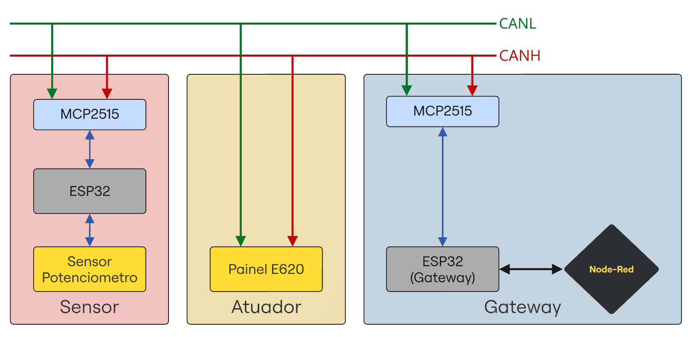
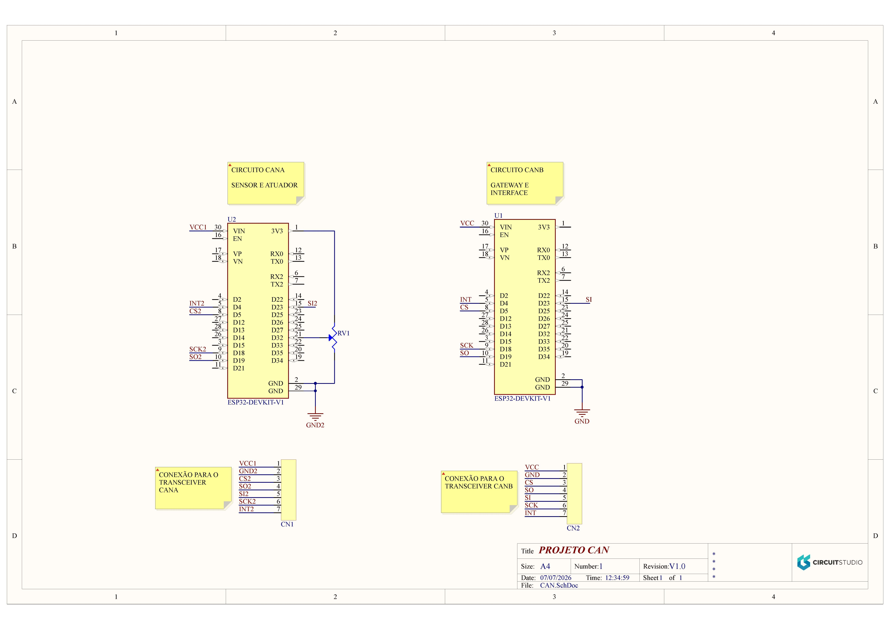
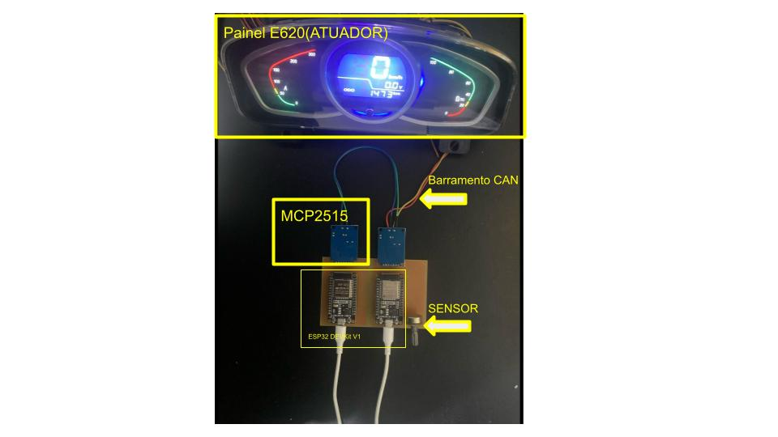
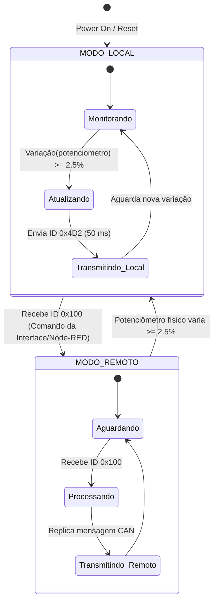
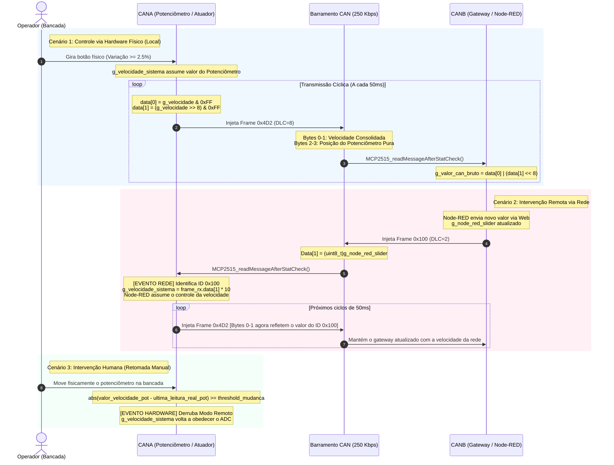
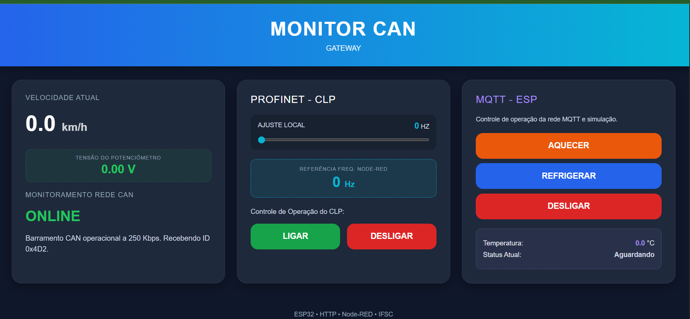

# 🟥 Rede CAN — Célula 2 (Alexandre & Alvaro)

---

## 1. Descrição do projeto

O protocolo local utilizado nesta célula é o **CAN (Controller Area Network)** operando a uma taxa de barramento industrial de **250 Kbps**. A rede é composta por microcontroladores **ESP32** acoplados a controladores autônomos de protocolo **MCP2515** via interface de periféricos serial (**SPI**). O ESP32 principal atua como o nó mestre/gateway local da bancada, coletando os sinais do barramento e disponibilizando uma interface gráfica de monitoramento por meio de um Web Server HTTP nativo. 

O grande objetivo desta célula é ler de maneira contínua os dados de um sensor analógico (potenciômetro) mapeado sob o identificador exclusivo CAN `, processar os pacotes para o cálculo de velocidade real em km/h e comandar um painel atuador de indicadores (Painel E620) via ID CAN `0x4D2`. O Gateway ESP32 também atua como **ponte** para o backbone (Node-RED) por meio de requisições assíncronas **HTTP (POST/GET)** em formato de texto puro (`text/plain`) e JSON. A grande vantagem desse design é garantir a operação offline e robusta da rede de campo CAN, enquanto permite a convergência com o sistema supervisório centralizado.

### Variáveis Disponíveis ao Node-RED / Servidor HTTP

| Nome / Recurso | Rota / Endpoint | Método HTTP | Tipo no Node-RED | Uso / Formato de Origem |
| :--- | :--- | :---: | :--- | :--- |
| `g_valor_can_bruto` | `/data` | **GET** | `Number` (via JSON) | Valor decimal bruto consolidado do sistema (origem bytes [0] e [1] do frame `0x4D2`). |
| `g_velocidade` | `/data` | **GET** | `Number` (via JSON) | Velocidade calculada e escalonada em km/h (`g_valor_can_bruto / 10.0f`). |
| `g_pot_hardware_bruto` | `/data` / Envio automático | **GET** / **POST** | `Number` (JSON) | Enviado ativamente para o Node-RED na rota `/can` como `tensao` calculada (0.00 a 3.30V). |
| `g_slider_value` | `/set_slider` | **POST** | `String` (Texto Puro) | Posição modificada no Slider da página HTML local. O ESP32 repassa ao Node-RED em `/slider`. |
| `g_node_red_slider` | `/set_nodered_value` | **POST** | `String` (Texto Puro) | Setpoint enviado do Node-RED para a rede CAN. Injeta um frame com ID `0x100` via barramento. |
| `g_node_red_freq` | `/set_nodered_freq` | **POST** | `String` (Texto Puro) | Referência de frequência lida do CLP e atualizada no ESP32 via Node-RED. |
| `g_mqtt_temperatura` & `g_mqtt_status` | `/set_mqtt_sim` | **POST** | `Object` (JSON) | Rota em que o Node-RED simula dados para o Card MQTT. Formato: `{"temp": X, "status": "Y"}`. |
| `ligar` | `/ligar` | **POST** | `String` (Texto Puro) | Comando de partida disparado pela interface web. O ESP32 propaga `"true"` para a rota `/ligar` do Node-RED. |
| `desligar` | `/desligar` | **POST** | `String` (Texto Puro) | Comando de paragem disparado pela interface web. O ESP32 propaga `"true"` para a rota `/desligar` do Node-RED. |
| `mqtt_aquecer` | `/mqtt_aquecer` | **POST** | `Object` (JSON) | Evento do Card MQTT gerado via HTML. Repassa `{"status":true}` para o endpoint `/mqtt_aquecer` do Node-RED. |
| `mqtt_resfriar` | `/mqtt_resfriar` | **POST** | `Object` (JSON) | Evento do Card MQTT gerado via HTML. Repassa `{"status":true}` para o endpoint `/mqtt_resfriar` do Node-RED. |
| `mqtt_desligar` | `/mqtt_desligar` | **POST** | `Object` (JSON) | Evento do Card MQTT gerado via HTML. Repassa `{"status":false}` para o endpoint `/mqtt_desligar` do Node-RED. |

## 2. Estrutura de dados

O display dashboard utilizado como atuador controlado por protocolo CAN foi obtido através de uma parceria com o laboratório EMOL do IFSC. Pertence a um kit de componentes automotivos elétricos.

 

<b>Display Dashboard E620</b>

  

No pdf “Technical requirements for E620-LJ” adquirido diretamente no site da Wuhan technologies na Alibaba, há uma tabela a qual fornece o método pelo qual cada item do dashboard é ligado. Todos os itens que possuem o parametro **Combination switch** na coluna **SIGNAL SOURCE** são operados através da comutação de entradas físicas, sinalizados pela coluna **SIGNAL FORMAT**, sendo high e low level respectivamente VCC/+12V e GND. Qualquer outro formato sinaliza estados internos e não são acessíveis pelo usuário ou programador. 
Itens com o **SIGNAL SOURCE** descrito como **controller**, podem ser acessados através do protocolo CAN, como indicado pela coluna **SIGNAL FORMAT**. O display E620 possui dois id’s CAN presentes no datasheet, contudo somente um deles funciona, e somente parcialmente, por tanto iremos documentar apenas o ID 0x4D2. Há também a existencia de ID's de formato longo, 24 bits ao invés de 12, no outro datasheet, não obtivemos sucesso com nenhum deles.

### Estrutura de envio de dados

Descrição geral das configurações das variaveis.

| Variavel | Descrição |
| :--- | :--- |
| `Velocidade` | BYTE0 e BYTE1 são responsáveis pelos velocímetro, com uma escala de 0,1 km por bit, chegando a no máximo 99 km |
| `Bateria` | Passamos todos os valores entre 0 e 255 e nada foi acionado no display. Ou o display está com problema ou a variável da bateria situa-se em outro id, o qual o manual de modelo que obtivemos não disponibilizam, nem mesmo os parametros **nope** ativaram alguma funcionalidade extra. |
| `Marcha` | BYTE 6 é responsável pela marcha, 0 para N, 1 para D, e 2 para R. Quaisquer outros valores irão fazer com que nenhum estado de marcha esteja ativo |
| `Erro` | BYTE7 é responsável pelo sinal de erro, qualquer número entre 1 e 255 irá fazer o display apitar e disponibilizar na tela o código de erro periodicamente. |

### Estrutura de envio de dados

A estrutura de dados reconhecida pelo display E620 é a de uma sequencia de 8 bytes, cada qual responsavel por uma variavel, ou parte dela. É possivel enviar menos que 8 bytes, o display ainda irá recebe-los, bytes não enviados serão setados com zero por padrão.

| ID | BYTE0 | BYTE1 | BYTE2 | BYTE3 | BYTE4 | BYTE5 | BYTE6 | BYTE7 |
| :--- | :--- | :---: | :--- | :--- | :--- | :--- | :--- | :--- |
| `ID: 0x4D2` | `velocidade LSB` | `velocidade MSB` | nope | nope | nope | `Bateria` | `Marcha` | `Erro` |

---
## 3. Descrição de funcionamento

O sistema é composto por duas placas ESP32 interligadas por um barramento CAN (250 Kbps) e integradas a uma interface web e ao Node-RED via HTTP. O objetivo principal é controlar a variável g_velocidade_sistema, gerenciando de forma inteligente quem tem a prioridade no momento (Concorrência).

  

<b>Topologia Física da Rede CAN - Célula 2</b>

  

1. CANA (Atuador e Sensor Físico)
O CANA lê continuamente um potenciômetro físico via ADC e monitora o barramento CAN. Ele opera sob duas regras de evento:

* Prioridade do Hardware (Movimento Físico): Para evitar que ruídos passem comandos falsos, o CANA calcula a variação do potenciômetro. Se o usuário girar o botão gerando uma variação maior ou igual a 2.5% (em relação à última leitura aceita), o Hardware assume o controle e sobrescreve a velocidade atual.

* Prioridade de Rede: Se o CANA detectar no barramento um frame com ID 0x100 (enviado pelo CANB/Node-RED), a Rede assume o controle imediatamente, atualizando a velocidade do sistema com o valor vindo do software.

Transmissão (ID 0x4D2): A cada 50ms, o CANA transmite de forma fixa a velocidade consolidada do sistema (Bytes 0 e 1) e a posição pura, em tempo real, do potenciômetro (Bytes 2 e 3).

 

<b>Esquemático da rede CAN</b>

  
2. CANB (Gateway, Servidor Web e Integração Node-RED)
O CANB atua como a ponte entre o mundo físico (Barramento CAN) e o mundo digital (Rede IP):

Recepção CAN e HTTP: Ele escuta o ID 0x4D2. Ele extrai a velocidade final e calcula de forma isolada a tensão do potenciômetro (0V a 3.3V), despachando esses dados consolidados via requisição POST HTTP para a rota /can do Node-RED.

Comando Remoto: Quando você atua no Node-RED ou no Slider da página Web, o CANB empacota esse comando e injeta no barramento CAN com o ID 0x100, fazendo o CANA mudar seu estado de controle.

📊 Transições de Estado de Concorrência
Hardware ➔ Rede: O sistema está rodando pelo potenciômetro. Assim que um frame 0x100 aparece na CAN, o sistema pula para o modo Rede, aceitando os valores do Slider remoto.

Rede ➔ Hardware: O sistema está obedecendo ao Node-RED. Se o operador girar o potenciômetro físico na bancada rompendo a barreira de 2.5% de variação, o comando físico "derruba" a rede e o Hardware reassume o controle imediatamente.

Rede/Hardware ➔ Zerado: Se o potenciômetro físico for levado até o zero absoluto (valor == 0), a concorrência prioriza a segurança física do hardware, forçando o sistema para o estado Zerado, bloqueando atuações indesejadas.

---

## 4. COMPONENTES

| Item | Descrição / Valor | Links / Especificações |
| :--- | :--- | :--- |
| **GATEWAY** | Microcontrolador ESP32 WROOM DEV-KIT V1 | [LINK](https://www.mercadolivre.com.br/esp32-wroom-devkit-v1-wifi-bluetooth-dual-core-esp32-desenvolvimento-iot-automaco-residencial-arduino-microcontrolador-programaco-eletrnica-blutu-projetos-inteligentes/p/MLB66943423?pdp_filters=item_id:MLB6491779650) |
| **Controlador CAN** | Módulo MCP2515 + Transceptor TJA1050 (Cristal de 8MHz / SPI) | [LINK](https://www.mercadolivre.com.br/modulo-can-bus-mcp2515-tja1050-obdii-serve-para-arduino/p/MLB32974037?pdp_filters=item_id:MLB4706675974) |
| **Atuador** | Painel de Indicadores de Bancada E620 (ID `0x4D2`) | [LINK](https://www.alibaba.com/product-detail/E620-Electric-Golf-cart-dash-board_1600587839114.html) |
| **Sensor** | Potenciômetro (250kohms) + Microcontrolador ESP32 WROOM DEV-KIT V1 (ID `0x100`) | [LINK](https://www.mercadolivre.com.br/kit-5-potenciometros-lineares-duplos-250k-l20-mini-wh1482/up/MLBU1988972032#polycard_client=search-desktop&be_origin=backend&search_layout=grid&position=8&type=product&tracking_id=3b02a30a-8222-4e3a-ae5f-84980110701d&wid=MLB4370191112&sid=search) |
| **Comunicação com backbone** | HTTP Client (POST / GET) nativo via `esp_http_client` (MIME: `text/plain`) | Protocolo de Rede |
| **Software** | ESP-IDF V5.4 | Ambiente de Desenvolvimento |

---

  

---

## 5. DIAGRAMA DE ESTADOS

### 1. MODO_LOCAL (Controle via Hardware Físico)
Ao ligar ou resetar o sistema (`Power On / Reset`), ele inicia automaticamente neste estado. O foco aqui é o controle manual na bancada:

* **Monitorando:** O sistema fica em repouso lendo continuamente o potenciômetro físico.
* **Atualizando:** Se o operador girar o botão e a leitura mudar mais de **2.5%**, o sistema sai do repouso para registrar a nova posição.
* **Transmitindo_Local:** Ele envia essa nova velocidade(km/h) para o barramento CAN através do **ID `0x4D2`** (a cada 50 ms) e volta a monitorar o botão físico.

### 2. MODO_REMOTO (Controle via Rede / Node-RED)
Este estado gerencia as ordens que chegam de fora, ou seja, comandos virtuais vindos do Node-RED:

* **Aguardando:** O sistema fica escutando o barramento CAN.
* **Processando:** Assim que o gateway injeta a mensagem com o **ID `0x100`** na rede (via node-red), o sistema captura o comando.
* **Transmitindo_Remoto:** Ele replica e consolida essa velocidade vinda da internet para o motor/atuador e volta a aguardar novas instruções da rede.

---

## 6. Diagrama de Sequência

---

## 7. INTERFACE DA REDE-CAN

Para melhor comunicação das redes foi utilizado um esp dedicado tanto para fazer a comunicação com o backbone e como interface .html do sistema. O microcontrolador CANA é responsável por tarefas de missão crítica: amostrar um sinal analógico (ADC) através de filtros de média móvel e gerenciar a concorrência de controle no barramento de campo (CAN).
Se o CANA também fizesse o papel de servidor web, o core do processador seria frequentemente interrompido para processar conexões de rede de sockets TCP, renderizar strings HTML massivas e gerenciar o handshake do Wi-Fi. Essas pilhas de rede (Network Stacks) possuem execução não-determinística, o que causaria atrasos (jitter) na leitura do potenciômetro e na transmissão cíclica de 50ms da CAN, comprometendo a precisão física do sistema.

* Painel de Monitoramento CAN (Card Atuador/Sensor): Apresenta visualmente a velocidade consolidada do sistema em tempo real e a tensão isolada calculada para o potenciômetro físico (0V a 3.3V). Ele serve como um diagnóstico rápido para atestar que o barramento a 250 Kbps está online e operando perfeitamente através do recebimento do ID 0x4D2.

* Controle PROFINET - CLP: Permite a interação direta com a lógica de frequência. Traz um controle local (Slider de 0 a 60 Hz) acoplado a travas de segurança JavaScript (userIsDragging) para que o valor não sofra oscilações enquanto o operador arrasta o ponteiro, além de exibir a frequência de referência vinda do Node-RED e botões industriais de LIGAR e DESLIGAR.

* Módulo MQTT - ESP: Uma área dedicada de telemetria e comandos de atuadores térmicos, apresentando botões para forçar estados de Aquecer, Refrigerar ou Desligar, com um display dinâmico.

  

