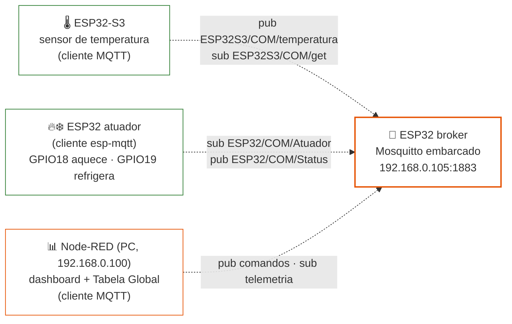
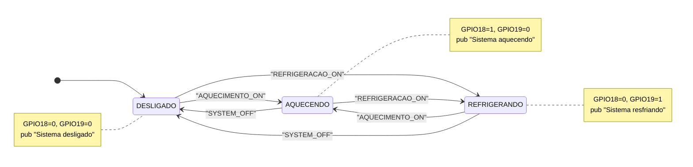

# Rede MQTT — Célula 3 (Lucas & Henzo)

---

## 1. Arquitetura da célula MQTT

A célula MQTT é composta por **três ESP32 com papéis distintos**. A "rede local" da célula **é o próprio MQTT**: os nós não se falam diretamente — tudo passa pelo broker.

| Nó | Papel | IP |
|----|----------|-------|
|  **Broker** | ESP32 rodando **Mosquitto embarcado** (componente `espressif/mosquitto` ^2.0.20), escutando `0.0.0.0:1883`. É o **servidor MQTT de todo o sistema NEXUS** — o Node-RED se conecta aqui como cliente. | `192.168.0.105` |
|  **Sensor** | Lê a temperatura e publica em `ESP32S3/COM/temperatura`; responde a solicitações em `ESP32S3/COM/get`. | — |
|  **Atuador** | Cliente `esp-mqtt` (ESP-IDF via PlatformIO, `esp32doit-devkit-v1`). Assina o tópico de comando e aciona **GPIO18 (aquecimento)** / **GPIO19 (refrigeração)**. | — |

Todos os nós conectam-se à rede Wi-Fi do projeto **`COM_N_26.1`**



**Leitura do diagrama:** todas as linhas são **MQTT sobre TCP/IP via Wi-Fi** (pontilhado = meio não guiado). Não há ligação física direta sensor→atuador: o acoplamento entre eles acontece **por tópicos**, mediado pelo broker. Isso é a topologia estrela característica do MQTT — e o motivo pelo qual a célula continua trocando dados internamente mesmo se o PC/Node-RED sair do ar (o broker não está no PC).

---

## 2. Tabela de tópicos (contrato da célula)

| Tópico | Direção (visão do broker) | Payload (string) | Publicador | Assinantes |
|--------|--------------------------|-------------------|------------|-----------|
| `ESP32S3/COM/temperatura` | entrada de telemetria | valor numérico em texto (ex.: `23.75`) | ESP32-S3 sensor | Node-RED |
| `ESP32S3/COM/get` | comando ao sensor | `GET_TEMP` | Node-RED | ESP32-S3 sensor |
| `ESP32/COM/Atuador` | comando ao atuador | `AQUECIMENTO_ON` · `REFRIGERACAO_ON` · `SYSTEM_OFF` | Node-RED | ESP32 atuador |
| `ESP32/COM/Status` | estado do atuador | `Sistema aquecendo` · `Sistema resfriando` · `Sistema desligado` · `ESP32 online` (no connect) | ESP32 atuador | Node-RED |

---

## 3. Firmware do atuador (`ESP32_act`)

| Item | Valor |
|------|-------|
| Board | `esp32doit-devkit-v1` |
| Plataforma | PlatformIO `espressif32@6.5.0` (ESP-IDF 5.1.x) |
| Cliente MQTT | `esp-mqtt` nativo do IDF |
| Broker configurado | `mqtt://192.168.0.105:1883` (hardcoded em `mqtt_app.c`) |
| Wi-Fi | SSID `COM_N_26.1`, rede aberta (sem campo de senha na `wifi_config_t`) |

### 3.1 Estrutura

```text
ESP32_act/
├── platformio.ini
├── include/
│   ├── atuador.h    ← GPIOs, enum acionamento_sistema_t
│   ├── mqtt_app.h   ← enum estado_sistema_t, mqtt_start(), mqtt_publish_status()
│   └── wifi.h       ← SSID
└── src/
    ├── main.c       ← wifi_init_sta() → delay 5 s → mqtt_start() → gpioInit()
    ├── atuador.c    ← gpioInit(), atualiza_saidas()
    ├── mqtt_app.c   ← conexão, subscribe, parser de comandos, publish de status
    └── wifi.c       ← station mode + reconexão automática
```

### 3.2 Máquina de estados **implementada** (comando remoto)

O firmware atual é um executor de comandos: não lê sensor e não decide nada sozinho. Cada string recebida em `ESP32/COM/Atuador` leva diretamente a um estado, e cada troca de estado publica o status:



| Estado | GPIO18 | GPIO19 | Como se chega |
|--------|:---:|:---:|----------------|
| `DESLIGADO` | 0 | 0 | Boot, ou comando `SYSTEM_OFF` |
| `AQUECENDO` | 1 | 0 | Comando `AQUECIMENTO_ON` |
| `REFRIGERANDO` | 0 | 1 | Comando `REFRIGERACAO_ON` |

`atualiza_saidas()` sempre **zera as duas saídas antes** de ligar a selecionada — intertravamento por software que impede aquecimento e refrigeração simultâneos mesmo em sequências rápidas de comandos.

---

## 4. Firmware do broker (`embedded_brocker`)

Projeto ESP-IDF (template `app-template`) cuja única função é **ser o servidor MQTT do sistema**:

- Dependência: `espressif/mosquitto: "^2.0.20~7"` (Mosquitto real, portado para ESP-IDF pela Espressif).
- `mosq_broker_run()` roda numa task FreeRTOS dedicada (stack de 8192 bytes, prioridade 5), escutando em `0.0.0.0:1883`, sem TLS.
- Um callback (`handle_message_cb`) loga no monitor serial **toda mensagem que atravessa o broker** — cliente, tópico, QoS, retain e payload. Na apresentação isso funciona como um *sniffer* de camada de aplicação.
  
---

## 5. Integração com o dashboard (Node-RED)

O Node-RED (`192.168.0.100`) conecta-se ao broker `192.168.0.105:1883` como cliente `Node-red` (MQTT v3.1.1) e expõe o grupo **REDE MQTT** no dashboard. O flow completo e sua documentação estão em [`../backbone/node_mqtt/`](../backbone/node_mqtt/README.md); em resumo:

| Widget | Nó dashboard | Fluxo |
|--------|--------------|-------|
| Botão **Aquecimento** | `ui_button` → `ESP32/COM/Atuador` | payload `AQUECIMENTO_ON` |
| Botão **Refrigeração** | `ui_button` → `ESP32/COM/Atuador` | payload `REFRIGERACAO_ON` |
| Botão **Desligar** | `ui_button` → `ESP32/COM/Atuador` | payload `SYSTEM_OFF` |
| Botão **Leitura temperatura** | `ui_button` → `ESP32S3/COM/get` | payload `GET_TEMP` |
| Texto **Status** | `ESP32/COM/Status` → `ui_text` | espelho do estado do atuador |
| Texto + **Chart temperatura** | `ESP32S3/COM/temperatura` → `ui_text`/`ui_chart` | telemetria com histórico |

A interoperabilidade cross-protocolo acontece no mesmo flow: comandos vindos do **CLP PROFINET** (`s7 in`, bits `DB7,X0.0..0.2`) e da **célula CAN** (`http in` `/mqtt_aquecer`, `/mqtt_resfriar`, `/mqtt_desligar`) convergem para os mesmos nós `function` que publicam em `ESP32/COM/Atuador` — ou seja, **qualquer rede opera o atuador desta célula**, e a temperatura desta célula é escrita de volta no CLP (`DB7,REAL2`) e enviada ao ESP da célula CAN via HTTP.

---

## 6. Problemas de Bancada

Quedas de conexão do Node-RED com o Broker

**Status:** resolvido em bancada (14/07/2026)
**Onde:** célula MQTT — broker embarcado no ESP32

---

## 6.1. Problema

Durante os testes de integração, a conexão entre o Node-RED e o broker MQTT
caía de forma repetida: conectava, ficava ativa por alguns segundos, caía,
reconectava e caía de novo — em ciclo, sem parar.

No início suspeitamos de problema de rede (Wi-Fi ou conflito de IP). Mas o
Wi-Fi estava estável e o ping para o broker (`192.168.0.105`) respondia
normalmente durante as quedas. Ou seja, a rede estava boa — o problema estava
na forma como o Node-RED se identificava para o broker.

## 6.2. Causa

Todo cliente que conecta em um broker MQTT precisa se identificar com um
**Client ID** — um nome que serve para o broker distinguir uma conexão da
outra. É parecido com um nome de usuário: o broker usa esse ID para saber quem
é quem, independentemente do IP.

A regra do MQTT é clara: **não pode haver duas conexões ativas com o mesmo
Client ID ao mesmo tempo.** Quando chega uma conexão nova usando um ID que já
está em uso, o broker derruba a conexão antiga e mantém a nova. Isso não é um
defeito do broker — é o comportamento que a especificação do MQTT exige.

No nosso caso, tínhamos **duas conexões do Node-RED usando o mesmo Client ID**
(`Node-red`, que é o valor padrão). Como as duas tinham reconexão automática,
elas entraram em um loop:

```
Conexão A ("Node-red") conecta  ->  broker aceita
Conexão B ("Node-red") conecta  ->  broker derruba A
A reconecta sozinha             ->  broker derruba B
B reconecta sozinha             ->  broker derruba A
... (loop infinito)
```

Uma ficava derrubando a outra continuamente. Era esse loop que aparecia para
nós como "a conexão com o broker fica caindo".

**Ponto importante:** o broker não limita o sistema a "um cliente por vez" —
ele aceita vários clientes ao mesmo tempo sem problema. O que ele não aceita é
**duas conexões com o mesmo Client ID**. A restrição é sobre a identidade, não
sobre a quantidade de clientes.

## 6.3. Como identificar esse problema

- No **monitor serial do ESP32**, o broker registra o Client ID de cada
  conexão. Ver o mesmo ID conectando e desconectando repetidamente é o sinal
  característico.
- No **Node-RED**, o status do broker fica alternando entre "connected" e
  "disconnected" em ciclo curto.
- **Dica de diagnóstico:** se o ping para o broker continua estável enquanto a
  conexão MQTT cai, o problema não é de rede — é da configuração dos clientes.

## 6.4. Solução

Demos um **Client ID diferente para cada conexão** do Node-RED, usando sufixos:

| Conexão              | ID antigo  | ID novo      |
|----------------------|------------|--------------|
| Node-RED — conexão 1 | `Node-red` | `Node-red_A` |
| Node-RED — conexão 2 | `Node-red` | `Node-red_B` |
| Conexões futuras     | `Node-red` | `Node-red_C`…|

Com IDs únicos, cada conexão passou a ser tratada de forma independente e o
broker manteve todas ativas ao mesmo tempo. Isso eliminou o loop.

## 6.5. Por que os ESP32 não tiveram esse problema

Os firmwares dos ESP32 (broker, atuador e sensor) **não definem um Client ID
fixo**. Nesse caso, o ESP-IDF gera um ID automático baseado no chip
(`ESP32_<código do chip>`), que é único para cada placa. Por isso eles nunca
colidem entre si. O risco de conflito existe só quando o ID é escolhido
manualmente — como no Node-RED e em ferramentas de teste.

## 6.6. Pendências 
- **Flows antigos ainda usam o ID repetido:** `test_update/trabalho_COM.json` e
  `backbone/PROJETO_NEXUS_FINAL.json` ainda têm `clientid: "Node-red"` sem
  sufixo. Se algum deles for importado junto com o flow corrigido, o problema
  volta. Padronizar todos com a convenção nova.
- **`Flows_VersãoFinal.json` aponta para o broker errado:** o ID está correto
  (`Node-red_A`), mas o broker configurado é `192.168.15.29` (rede de teste em
  casa). Corrigir para `192.168.0.105` antes de usar na bancada.

## 6.7. O que aprendemos

- Nem toda queda de conexão é problema de rede. O MQTT gerencia as conexões
  pelo Client ID, e IDs repetidos causam quedas que parecem instabilidade de
  Wi-Fi, mas não são.
- O broker agiu corretamente o tempo todo — derrubar a conexão antiga quando um
  ID se repete é uma regra do próprio protocolo.
- Vale diagnosticar por partes: com o ping estável e a conexão MQTT caindo, dá
  para concluir que o problema está na configuração dos programas, não na rede.
---

## 7. Conteúdo desta pasta

```text
rede-mqtt/
├── README.md
├── componentes/   ← lista de componentes, datasheets
├── diagramas/     ← exports dos diagramas
├── figs/          ← fotos da bancada
└── firmware/
    ├── ESP32_act.rar         ← projeto PlatformIO do atuador
    ├── embedded_brocker.rar  ← projeto ESP-IDF do broker Mosquitto
    └── trabalho_COM.json     ← flow Node-RED da coluna MQTT
```
