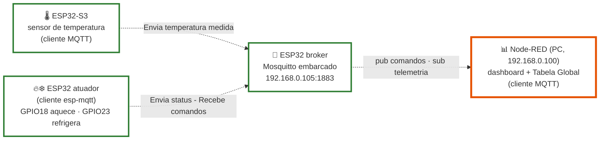
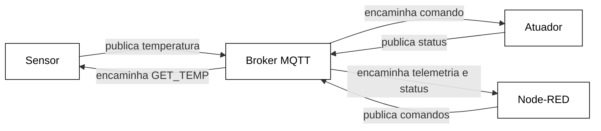

# Célula 3 — Comunicação baseada em MQTT (Lucas & Henzo)

---

## 1. Arquitetura da célula MQTT

A célula utiliza uma rede local Wi-Fi baseada em TCP/IP (SSID COM_N_26.1, provida pelo ponto de acesso TP-Link em 192.168.0.167). Sobre essa infraestrutura, os dispositivos trocam mensagens por meio do protocolo MQTT, utilizando um broker embarcado em um ESP32. A célula é composta por três nós com papéis distintos: A célula utiliza uma rede local Wi-Fi baseada em TCP/IP (SSID COM_N_26.1, provida pelo ponto de acesso TP-Link em 192.168.0.167). Sobre essa infraestrutura, os dispositivos trocam mensagens por meio do protocolo MQTT, utilizando um broker embarcado em um ESP32. A célula é composta por três nós com papéis distintos:

| Nó | Papel | IP |
|----|----------|-------|
|  **Broker** | ESP32 rodando **Mosquitto embarcado** (componente `espressif/mosquitto` ^2.0.20), escutando `0.0.0.0:1883`. É o **servidor da célula MQTT** | `192.168.0.105` |
|  **Sensor** | ESP32-S3 com sensor DS18B20. Publica a temperatura em ESP32S3/COM/temperatura quando solicitado pelo comando GET_TEMP recebido em ESP32S3/COM/get.| — |
|  **Atuador** | Cliente esp-mqtt (ESP-IDF via PlatformIO, placa esp32doit-devkit-v1). Assina o tópico de comando e aciona GPIO18 (aquecimento) / GPIO23 (refrigeração).| — |

Todos os nós conectam-se à rede Wi-Fi do projeto **`COM_N_26.1`**



1.2 Arquitetura lógica MQTT
Em nível de aplicação, a topologia é em estrela em torno do broker: os clientes não se comunicam diretamente entre si — publicam e assinam tópicos, e o broker encaminha as mensagens.

1.3 Papel do Node-RED no laço de controle
Um ponto importante da arquitetura atual: não existe acoplamento direto sensor → atuador. O atuador não assina o tópico de temperatura, e o sensor não publica comandos. Quem fecha o laço é o Node-RED, de modo que o caminho efetivo da informação é:
```text
Sensor → Broker → Node-RED → Broker → Atuador
```

## 2. Tabela de tópicos (contrato da célula)

| Tópico | Direção (visão do broker) | Payload (string) | Publicador | Assinantes |
|--------|--------------------------|-------------------|------------|-----------|
| `nexus/mqtt/sensor/temperature` | entrada de telemetria | temperatura no formato `±XXX.Y` (ex.: `+025.5`); na conexão publica `ESP32 online` | ESP32-S3 sensor | Node-RED |
| `nexus/mqtt/sensor/request` | comando ao sensor | `GET_TEMP` | Node-RED | ESP32-S3 sensor |
| `nexus/mqtt/actuator/command` | comando ao atuador | `AQUECIMENTO_ON` · `REFRIGERACAO_ON` · `SYSTEM_OFF` | Node-RED | ESP32 atuador |
| `nexus/mqtt/actuator/state` | estado do atuador | `Sistema aquecendo` · `Sistema resfriando` · `Sistema desligado` · `Aguardando comando` · `ESP32 online` (na conexão) | ESP32 atuador | Node-RED |

---

## 3. Firmware do atuador (`ESP32\_act`)

|Item|Valor|
|-|-|
|Placa|`esp32doit-devkit-v1`|
|Plataforma|PlatformIO `espressif32@6.5.0` (ESP-IDF 5.1.x)|
|Cliente MQTT|`esp-mqtt` nativo do ESP-IDF|
|Broker configurado|`mqtt://192.168.0.105:1883` (definido diretamente em `mqtt\_app.c`)|
|Wi-Fi|SSID `COM\_N\_26.1`, rede aberta (sem campo de senha na `wifi\_config\_t`); IP por DHCP|

### 3.1 Estrutura

```text
ESP32\_act/
├── platformio.ini
├── include/
│   ├── atuador.h    ← GPIOs, enum acionamento\_sistema\_t
│   ├── mqtt\_app.h   ← enum estado\_sistema\_t, mqtt\_start(), mqtt\_publish\_status()
│   └── wifi.h       ← SSID
└── src/
    ├── main.c       ← wifi\_init\_sta() → espera fixa de 5 s → mqtt\_start() → gpioInit()
    ├── atuador.c    ← gpioInit(), atualiza\_saidas()
    ├── mqtt\_app.c   ← conexão, assinatura, interpretação de comandos, publicação de status
    └── wifi.c       ← modo estação + reconexão automática

```

3.2. Firmware do sensor (`mqtt\_temp\_sense`)

|Item|Valor|
|-|-|
|Placa|`esp32-s3-devkitm-1`|
|Plataforma|PlatformIO `espressif32@6.5.0` (framework ESP-IDF)|
|Sensor|**DS18B20** (sensor digital de temperatura)|
|Interface|Barramento **1-Wire** implementado por software (temporização por GPIO), no **GPIO 45**|
|Resolução configurada|12 bits (0,0625 °C internos); a formatação de saída publica com passo de **0,5 °C**|
|Formato publicado|String `±XXX.Y` — ex.: `+025.5`, `-010.0`|
|Calibração / filtragem|Não implementadas (valor bruto do sensor)|
|Publicação|**Somente sob solicitação** (`GET\_TEMP`); não há publicação periódica|
|Broker configurado|`mqtt://192.168.0.105:1883` (definido diretamente em `mqtt\_app.c`)|
|Wi-Fi|SSID `COM\_N\_26.1`, rede aberta; IP por DHCP|
|Reconexão|Wi-Fi: reconexão imediata a cada desconexão (sem espera progressiva). MQTT: reconexão automática do cliente `esp-mqtt`|

### 3.3 Estrutura

```text
mqtt\_temp\_sense/
├── platformio.ini
├── include/
│   ├── DS18B20.h    ← pino do sensor, códigos de erro, API do 1-Wire
│   ├── mqtt\_app.h   ← mqtt\_start(), mqtt\_publish\_temp()
│   └── wifi.h       ← SSID
└── src/
    ├── main.c       ← wifi\_init\_sta() → ds18b20\_init() → set\_resolution(12) → espera fixa de 5 s → mqtt\_start()
    ├── DS18B20.c    ← protocolo 1-Wire e leitura/formatação da temperatura
    ├── mqtt\_app.c   ← conexão, assinatura de ESP32S3/COM/get, tratamento do GET\_TEMP
    └── wifi.c       ← modo estação + reconexão automática
```

### 3.4 Comportamento

1. Na conexão ao broker, assina `ESP32S3/COM/get` (QoS 1) e publica `ESP32 online` em `ESP32S3/COM/temperatura`.
2. Ao receber `GET\_TEMP` (com remoção de CR/LF do payload), lê o DS18B20 e publica a temperatura formatada.

---

### 4. Máquina de estados **implementada** (comando remoto)

O firmware atual é um executor de comandos: não lê sensor e não decide nada sozinho. Cada string recebida em `ESP32/COM/Atuador` leva diretamente a um estado, e cada troca de estado publica o status:


| Estado | GPIO18 | GPIO23 | Como se chega |
|--------|:---:|:---:|----------------|
| `DESLIGADO` | 0 | 0 | Boot, ou comando `SYSTEM_OFF` |
| `AQUECENDO` | 1 | 0 | Comando `AQUECIMENTO_ON` |
| `REFRIGERANDO` | 0 | 1 | Comando `REFRIGERACAO_ON` |

`atualiza_saidas()` sempre **zera as duas saídas antes** de ligar a selecionada — intertravamento por software que impede aquecimento e refrigeração simultâneos mesmo em sequências rápidas de comandos.

---

## 4. Firmware do broker (`embedded_broker`)

Projeto ESP-IDF (template `app-template`) cuja única função é **ser a comunicação entre célula MQTT e Node-RED**:

- Dependência: `espressif/mosquitto: "^2.0.20~7"` (Mosquitto real, portado para ESP-IDF pela Espressif).
- `mosq_broker_run()` roda numa task FreeRTOS dedicada (stack de 8192 bytes, prioridade 5), escutando em `0.0.0.0:1883`, sem TLS.
- Um callback (`handle_message_cb`) loga no monitor serial **toda mensagem que atravessa o broker** — cliente, tópico, QoS, retain e payload. Na apresentação isso funciona como um *sniffer* de camada de aplicação.
  
---

## 5. Integração com o dashboard (Node-RED)

O Node-RED (`192.168.0.100`) conecta-se ao broker `192.168.0.105:1883` como cliente `Node-red` (MQTT v3.1.1) e expõe o grupo **REDE MQTT** no dashboard. O flow completo e sua documentação está na documentação do backbone; em resumo:

| Widget | Nó dashboard | Fluxo |
|--------|--------------|-------|
| Botão **Aquecimento** | `ui_button` → `ESP32/COM/Atuador` | payload `AQUECIMENTO_ON` |
| Botão **Refrigeração** | `ui_button` → `ESP32/COM/Atuador` | payload `REFRIGERACAO_ON` |
| Botão **Desligar** | `ui_button` → `ESP32/COM/Atuador` | payload `SYSTEM_OFF` |
| Botão **Leitura temperatura** | `ui_button` → `ESP32S3/COM/get` | payload `GET_TEMP` |
| Texto **Status** | `ESP32/COM/Status` → `ui_text` | espelho do estado do atuador |
| Texto + **Chart temperatura** | `ESP32S3/COM/temperatura` → `ui_text`/`ui_chart` | telemetria com histórico |

A interoperabilidade cross-protocolo acontece no mesmo flow: comandos vindos do **CLP PROFINET** (`s7 in`, bits `DB7,X0.0..0.2`) e da **célula CAN** (`http in` `/mqtt_aquecer`, `/mqtt_resfriar`, `/mqtt_desligar`) convergem para os mesmos nós `function` que publicam em `ESP32/COM/Atuador` — ou seja, **qualquer rede opera o atuador desta célula**, e a temperatura desta célula é escrita de volta no CLP (`DB7,REAL2`) e enviada ao ESP da célula CAN via HTTP.

---

## 6. Problemas de Bancada

### Quedas de conexão do Node-RED com o broker

**Situação:** resolvido em bancada (14/07/2026)
**Onde:** célula MQTT — broker embarcado no ESP32

### 6.1 Problema

Durante os testes de integração, a conexão entre o Node-RED e o broker MQTT caía de forma repetida: conectava, permanecia ativa por alguns segundos, caía, reconectava e caía novamente — em ciclo contínuo.

No início, suspeitamos de problema de rede (Wi-Fi ou conflito de IP). Porém, o Wi-Fi estava estável e o *ping* para o broker (`192.168.0.105`) respondia normalmente durante as quedas. A conectividade IP permaneceu disponível ao longo de todo o episódio — o que direcionou a investigação para as camadas superiores: a forma como o Node-RED se identificava para o broker.

### 6.2 Causa

Todo cliente que se conecta a um broker MQTT precisa se identificar com um **Client ID**. O Client ID é um **identificador lógico** utilizado pelo broker para distinguir as conexões e, conforme a configuração, associá-las a sessões MQTT — ele não é uma credencial de autenticação.

A regra do MQTT é clara: **não pode haver duas conexões ativas com o mesmo Client ID ao mesmo tempo.** Quando chega uma conexão nova usando um ID que já está em uso, o broker encerra a conexão antiga e mantém a nova. Isso não é um defeito do broker — é o comportamento que a especificação do MQTT exige (MQTT 3.1.1, seção 3.1.4).

No nosso caso, havia **duas conexões do Node-RED usando o mesmo Client ID** (`Node-red`, valor padrão da ferramenta). Como as duas tinham reconexão automática, elas entraram em um ciclo:

```text
Conexão A ("Node-red") conecta  ->  broker aceita
Conexão B ("Node-red") conecta  ->  broker encerra A
A reconecta automaticamente     ->  broker encerra B
B reconecta automaticamente     ->  broker encerra A
... (ciclo contínuo)
```

Cada nova conexão encerrava a anterior, continuamente. Era esse ciclo que se manifestava para nós como "a conexão com o broker fica caindo".

**Ponto importante:** o broker não limita o sistema a "um cliente por vez" — ele aceita vários clientes simultâneos sem problema. O que ele não aceita é **duas conexões com o mesmo Client ID**. A restrição é sobre a identidade, não sobre a quantidade de clientes.

### 6.3 Como identificar esse problema

* No **monitor serial do ESP32**, o broker registra o Client ID de cada conexão. Ver o mesmo ID conectando e desconectando repetidamente é o sinal característico.
* No **Node-RED**, o estado do broker fica alternando entre "connected" e "disconnected" em ciclo curto.
* **Dica de diagnóstico:** a permanência do *ping* durante as quedas **reduz a probabilidade** de uma falha geral de conectividade IP e **direciona a investigação** para as camadas TCP e MQTT e para a configuração dos clientes. Ela não elimina, por si só, outras hipóteses (perda seletiva de pacotes TCP, problemas na porta 1883, sobrecarga do broker, esgotamento de recursos), mas indica por onde começar.

### 6.4 Solução

Foi atribuído um **Client ID diferente para cada conexão** do Node-RED, usando sufixos:

|Conexão|ID antigo|ID novo|
|-|-|-|
|Node-RED — conexão 1|`Node-red`|`Node-red\\\_A`|
|Node-RED — conexão 2|`Node-red`|`Node-red\\\_B`|
|Conexões futuras|`Node-red`|`Node-red\\\_C`…|

Com IDs únicos, cada conexão passou a ser tratada de forma independente e o broker manteve todas ativas ao mesmo tempo, eliminando o ciclo de quedas.

### 6.5 Por que os ESP32 não tiveram esse problema

Os firmwares dos ESP32 (broker, atuador e sensor) **não definem um Client ID fixo**. Nesse caso, o ESP-IDF gera um ID automático baseado no chip (`ESP32\\\_<código do chip>`), que é único para cada placa. Por isso eles nunca colidem entre si. O risco de conflito existe apenas quando o ID é escolhido manualmente — como no Node-RED e em ferramentas de teste.

## 6.6. Pendências 
- **Flows antigos ainda usam o ID repetido:** `test_update/trabalho_COM.json` e
  `backbone/PROJETO_NEXUS_FINAL.json` ainda têm `clientid: "Node-red"` sem
  sufixo. Se algum deles for importado junto com o flow corrigido, o problema
  volta. Padronizar todos com a convenção nova.
- **`Flows_VersãoFinal.json` aponta para o broker errado:** o ID está correto
  (`Node-red_A`), mas o broker configurado é `192.168.15.29` (rede de teste em
  casa). Corrigir para `192.168.0.105` antes de usar na bancada.

## 6.7. O que aprendemos

* Nem toda queda de conexão é problema de rede. O MQTT gerencia as conexões pelo Client ID, e IDs repetidos causam quedas que se parecem com instabilidade de Wi-Fi, mas não são.
* O broker agiu corretamente o tempo todo — encerrar a conexão antiga quando um ID se repete é uma regra do próprio protocolo.
* Vale diagnosticar por camadas: com a conectividade IP confirmada (*ping* estável) e a conexão MQTT caindo, a investigação se concentra na configuração dos clientes e nas camadas superiores, em vez de na infraestrutura de rede.
---

## 7. Conteúdo desta pasta

```text
rede-mqtt/
├── README.md
├── componentes/   ← lista de componentes, datasheets
├── diagramas/     ← exports dos diagramas
├── figs/          ← fotos da bancada
└── firmware/
    ├── ESP32_act          ← projeto PlatformIO do atuador
    ├── embedded_broker    ← projeto ESP-IDF do broker Mosquitto
    └── Flows_VersãoFinal  ← flow Node-RED da coluna MQTT
    └── mqtt_temp_sense    ← projeto PlatformIO do atuador
```
