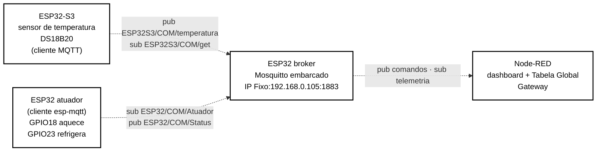
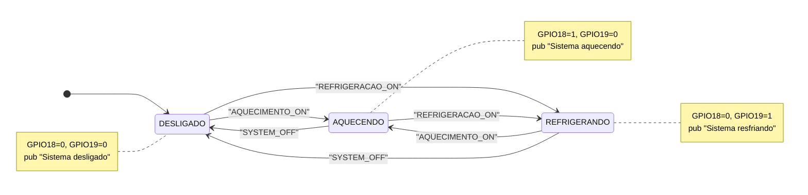

# Diagrama de blocos — Célula MQTT (Dupla 3: Lucas & Henzo)

----


| Elemento | Significado |
|---|---|
| **Sensoriamento** | DS18B20 (1-Wire) → ESP32-S3, que publica a leitura e responde a solicitações de leitura sob demanda. |
| **Broker da célula** | ESP32 dedicado rodando Mosquitto embarcado — é o servidor MQTT de toda a célula. |
| **Atuação** | ESP32 atuador assina o comando do broker e aciona os dois relés, acionando o aquecimento ou refrigeração. |
| **Node-RED** | Cliente externo do broker — não faz parte fisicamente da célula, mas é quem opera/monitora via dashboard. |

---

## 2. Tabela de tópicos (contrato da célula)

| Tópico | Direção (visão do broker) | Payload (string) | Publicador | Assinantes |
|--------|--------------------------|-------------------|------------|-----------|
| `ESP32S3/COM/temperatura` | entrada de telemetria | valor numérico em texto (ex.: `23.75`) | ESP32-S3 sensor | Node-RED |
| `ESP32S3/COM/get` | comando ao sensor | `GET_TEMP` | Node-RED | ESP32-S3 sensor |
| `ESP32/COM/Atuador` | comando ao atuador | `AQUECIMENTO_ON` · `REFRIGERACAO_ON` · `SYSTEM_OFF` | Node-RED | ESP32 atuador |
| `ESP32/COM/Status` | estado do atuador | `Sistema aquecendo` · `Sistema resfriando` · `Sistema desligado` · `ESP32 online` (no connect) | ESP32 atuador | Node-RED |

---

## 3. Firmware do atuador (`ESP32_act`)

| Item | Valor |
|------|-------|
| Board | `esp32doit-devkit-v1` |
| Plataforma | PlatformIO `espressif32@6.5.0` (ESP-IDF 5.1.x) |
| Cliente MQTT | `esp-mqtt` nativo do IDF |
| Broker configurado | `mqtt://192.168.0.105:1883` (hardcoded em `mqtt_app.c`) |
| Wi-Fi | SSID `COM_N_26.1`, rede aberta (sem campo de senha na `wifi_config_t`) |

### 3.1 Estrutura

```text
ESP32_act/
├── platformio.ini
├── include/
│   ├── atuador.h    ← GPIOs, enum acionamento_sistema_t
│   ├── mqtt_app.h   ← enum estado_sistema_t, mqtt_start(), mqtt_publish_status()
│   └── wifi.h       ← SSID
└── src/
    ├── main.c       ← wifi_init_sta() → delay 5 s → mqtt_start() → gpioInit()
    ├── atuador.c    ← gpioInit(), atualiza_saidas()
    ├── mqtt_app.c   ← conexão, subscribe, parser de comandos, publish de status
    └── wifi.c       ← station mode + reconexão automática
```

### 3.2 Máquina de estados **implementada** (comando remoto)

O firmware atual é um executor de comandos: não lê sensor e não decide nada sozinho. Cada string recebida em `ESP32/COM/Atuador` leva diretamente a um estado, e cada troca de estado publica o status:



| Estado | GPIO18 | GPIO19 | Como se chega |
|--------|:---:|:---:|----------------|
| `DESLIGADO` | 0 | 0 | Boot, ou comando `SYSTEM_OFF` |
| `AQUECENDO` | 1 | 0 | Comando `AQUECIMENTO_ON` |
| `REFRIGERANDO` | 0 | 1 | Comando `REFRIGERACAO_ON` |

`atualiza_saidas()` sempre **zera as duas saídas antes** de ligar a selecionada — intertravamento por software que impede aquecimento e refrigeração simultâneos mesmo em sequências rápidas de comandos.

---

## 4. Firmware do broker (`embedded_brocker`)

Projeto ESP-IDF (template `app-template`) cuja única função é **ser o servidor MQTT do sistema**:

- Dependência: `espressif/mosquitto: "^2.0.20~7"` (Mosquitto real, portado para ESP-IDF pela Espressif).
- `mosq_broker_run()` roda numa task FreeRTOS dedicada (stack de 8192 bytes, prioridade 5), escutando em `0.0.0.0:1883`, sem TLS.
- Um callback (`handle_message_cb`) loga no monitor serial **toda mensagem que atravessa o broker** — cliente, tópico, QoS, retain e payload. Na apresentação isso funciona como um *sniffer* de camada de aplicação.
  
---

## 5. Integração com o dashboard (Node-RED)

O Node-RED (`192.168.0.100`) conecta-se ao broker `192.168.0.105:1883` como cliente `Node-red` (MQTT v3.1.1) e expõe o grupo **REDE MQTT** no dashboard. O flow completo e sua documentação estão em [`../backbone/node_mqtt/`](../backbone/node_mqtt/README.md); em resumo:

| Widget | Nó dashboard | Fluxo |
|--------|--------------|-------|
| Botão **Aquecimento** | `ui_button` → `ESP32/COM/Atuador` | payload `AQUECIMENTO_ON` |
| Botão **Refrigeração** | `ui_button` → `ESP32/COM/Atuador` | payload `REFRIGERACAO_ON` |
| Botão **Desligar** | `ui_button` → `ESP32/COM/Atuador` | payload `SYSTEM_OFF` |
| Botão **Leitura temperatura** | `ui_button` → `ESP32S3/COM/get` | payload `GET_TEMP` |
| Texto **Status** | `ESP32/COM/Status` → `ui_text` | espelho do estado do atuador |
| Texto + **Chart temperatura** | `ESP32S3/COM/temperatura` → `ui_text`/`ui_chart` | telemetria com histórico |

A interoperabilidade cross-protocolo acontece no mesmo flow: comandos vindos do **CLP PROFINET** (`s7 in`, bits `DB7,X0.0..0.2`) e da **célula CAN** (`http in` `/mqtt_aquecer`, `/mqtt_resfriar`, `/mqtt_desligar`) convergem para os mesmos nós `function` que publicam em `ESP32/COM/Atuador` — ou seja, **qualquer rede opera o atuador desta célula**, e a temperatura desta célula é escrita de volta no CLP (`DB7,REAL2`) e enviada ao ESP da célula CAN via HTTP.

---

## 6. Pendências

---

## 7. Conteúdo desta pasta

```text
rede-mqtt/
├── README.md
├── componentes/   ← lista de componentes, datasheets
├── diagramas/     ← exports dos diagramas
├── figs/          ← fotos da bancada
└── firmware/
    ├── ESP32_act.rar         ← projeto PlatformIO do atuador
    ├── embedded_brocker.rar  ← projeto ESP-IDF do broker Mosquitto
    └── trabalho_COM.json     ← flow Node-RED da coluna MQTT
```
