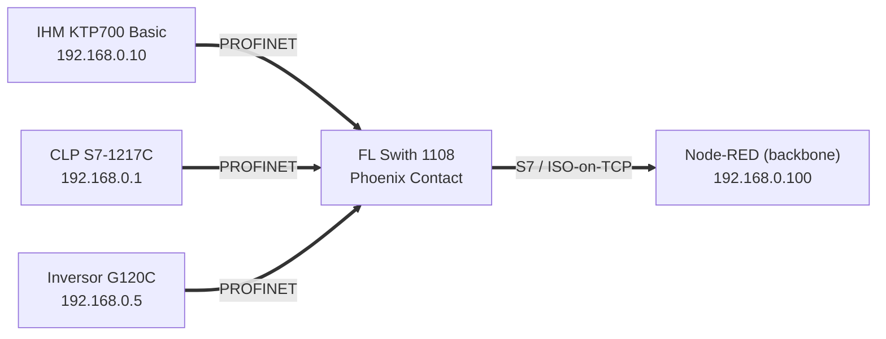
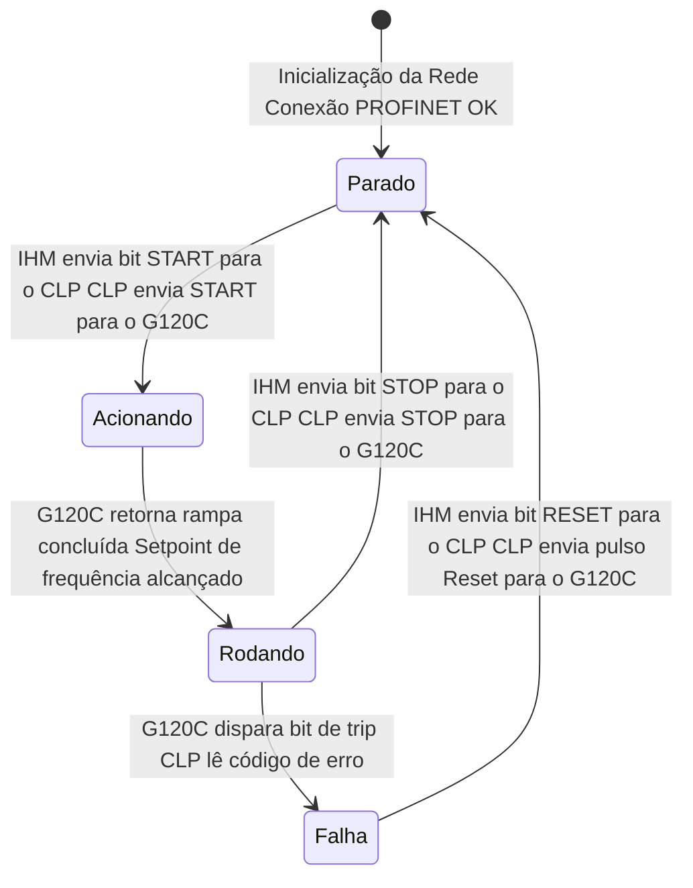
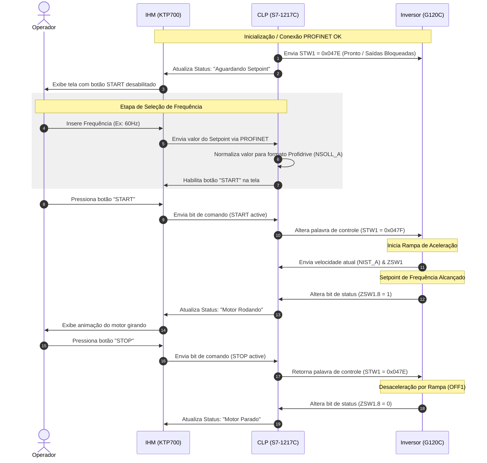

# 🟦 Rede PROFINET — Célula 1 (Cainã & Matheus)

[](https://www.profibus.com/)
[](#)

---

## 1. Descrição do projeto

O protocolo local utilizado é o **PROFINET**, com um CLP s7 1217C usado como mestre da rede, uma IHM operando como sensor e tela de visualização e um Inversor de Frequência, atuando como um atuador final. O CLP também atua como **bridge** para o backbone (node-red) via protocolo **S7 / ISO‑on‑TCP**, um protocolo nativo do proprio CLP. 

A ideia dentro desta rede é de controlar um motor de 380V e 2cv de potencia atraves de um inversor de frequencia, para isso sera usado a IHM para definir a frequencia, ligar e desligar o motor. Toda a comunicação dentro desta rede independe do backbone, podendo funcionar de forma offline. O grande diferencial desta abordagem é poder conectar dois mundos aparentemente distantes: um motor de alta potencia e um Dashboard altamente tecnologico e moderno.  

| Item | Valor |
|------|-------|
| Controlador | **CLP Siemens S7‑1217 C** (endpoint `192.168.0.1`, rack 0 / slot 1) |
| Sensor / IHM | **IHM KTP700 Basic** (endpoint `192.168.0.10`) |
| Atuador | **Inversor de frequência SINAMICS G120C** (endpoint `192.168.0.5`) |
| Bridge backbone | **S7 / ISO‑on‑TCP** via `node‑red‑contrib‑s7` (cycletime 1000 ms) |
| Software | TIA Portal _(versão: V20)_ |

### Variáveis Disponiveis ao Node-RED

| Nome | Endereço | Tipo | Uso |
|------|----------|------|-----|
| `START` | `DB4.DBX0.0` | bool | Liga o inversor |
| `STOP` | `DB4.DBX0.1` | bool | Desliga o inversor |
| `ENTRADA_REF_FREQUENCIA` | `DB4,REAL2` | real | Seta frequência |
| `FDK_HZ` | `DB2,REAL6` | real | Feedback de frequência |
| `RESET_INV` | `DB4,x0.2` | bool | Reseta as falhas no inversor de frequência |
| `HABILITA NODE RED` | `DB2,X10.1` | bool | Habilita o comando via node red |
| `FDK_VEL` | `DB6,REAL4` | real | Feedback da velocidade rede can |
| `SET_VEL` | `DB6,REAL0` | real | Seta o valor da velocidade rede can |
| `Liga_AQ` | `DB7,X0.0` | bool | Liga o Aquecedor rede MQTT |
| `Liga_Vent` | `DB7,X0.1` | bool | Liga o Ventilador rede MQTT |
| `Desliga_Vent_AQ` | `DB7,X0.2` | bool | Desliga o Ventilador ou o Aquecedor rede MQTT |
| `FDK_temp` | `DB7,REAL2` | real | Feedback do valor da temperatura rede MQTT |


---

## 2. Diagrama de blocos

O sistema adota uma **topologia em estrela**, onde todas as comunicações são centralizadas em um swtich. Esta abordagem minimiza o impacto de falhas individuais nos cabos e simplifica o diagnóstico e a manutenção da infraestrutura de comunicação.

* **Switch Industrial Phoenix Contact FL Switch 1108** Atua como o nó central da rede Profinet. É responsável pelo chaveamento físico dos pacotes de dados, garantindo a comutação eficiente entre a camada de controle de campo e a camada de monitoramento.

* **CLP Siemens S7-1217C. Endereço IP: `192.168.0.1`** Unidade central de processamento e lógica. Executa o algoritmo de controle do processo, gerencia os intertravamentos de segurança e coordena os demais periféricos.
 
* **IHM Siemens KTP700 Basic. Endereço IP: `192.168.0.10`** Interface Homem-Máquina. Permite a interação do operador com o sistema para a visualização de variáveis em tempo real, inserção de parâmetros operacionais e interação com as demais redes.
 
* **Inversor de Frequência Siemens Sinamics G120C. Endereço IP: `192.168.0.5`** Acionamento e controle de velocidade do motor elétrico. Envia dados de diagnóstico (frequencia, ligado, desligado e falhas) e recebe comandos de frequência do CLP.
  
* **Camada de Supervisão e Integração (Backbone) Node-RED. Endereço IP: `192.168.0.100`** Atua como o *backbone* de dados e gateway IoT. É responsável por coletar informações das redes para exibição em dashboards. Alem de gerenciar o acionamento e controle entre as redes. 
 



---

## 3. Diagrama de Estados 

Este diagrama de estados descreve a sequência lógica de controle e a troca de sinais que ocorrem via rede **PROFINET** entre a **IHM KTP700**, o **CLP S7-1217C** e o **Inversor G120C** durante o ciclo de operação do motor.

* **Inicialização -> PARADO:** `Inicialização da Rede Conexão PROFINET OK`: Ao ligar o painel elétrico, o Switch Phoenix Contact estabelece a comunicação entre todos os nós. Assim que o CLP reconhece a presença da IHM e do G120C na rede sem erros de barramento, o sistema entra no modo de espera seguro (`Parado`).
 

* **PARADO -> ACIONANDO:** `IHM envia bit START para o CLP / CLP envia START para o G120C`: O operador pressiona o botão de partida na tela da IHM. Essa informação é enviada via rede para o CLP, que processa as lógicas de intertravamento. Estando tudo correto, o CLP envia a palavra de comando com o bit de partida para o inversor via PROFINET, partindo o motor.


* **ACIONANDO -> RODANDO:** `G120C retorna rampa concluída / Setpoint de frequência alcançado`: O inversor acelera o motor. Assim que a frequência real medida pelo drive se iguala à frequência desejada (Setpoint), o inversor atualiza sua palavra de status na rede informando ao CLP que a rampa foi concluída. O sistema assume o estado `Rodando`.

* **RODANDO -> PARADO:** `IHM envia bit STOP para o CLP / CLP envia STOP para o G120C`: Durante a operação normal, o operador solicita a parada através da IHM. O comando é enviado para o CLP, que remove o sinal de partida enviado ao inversor. O G120C desacelera o motor de forma controlada até a parada total, retornando ao estado `Parado`.

* **RODANDO -> FALHA:** `G120C dispara bit de trip / CLP lê código de erro`: Se ocorrer qualquer anomalia elétrica ou mecânica com o motor em movimento, o inversor corta a saída por proteção e envia instantaneamente um bit de "Trip" (Falha Ativa) para o CLP via PROFINET, além do código correspondente ao erro. O CLP bloqueia o sistema e envia o alarme para a tela da IHM.

* **FALHA -> PARADO:** `IHM envia bit RESET para o CLP / CLP envia pulso Reset para o G120C`: Após o operador verificar e sanar a causa do problema no campo, ele pressiona o botão de "Reset" na IHM. O CLP recebe a solicitação e envia um pulso de borda de subida no bit de reset para o inversor através da rede. Se a falha sumir, o inversor limpa o erro e o sistema volta a ficar pronto no estado `Parado`.




## 4. Diagrama de Sequência

O **Diagrama de Sequência** apresentado mostra a sequencia de comandos necessários para acionar o inversor na perspectiva de um usuário usando a IHM via rede Profinet. A cada interação do usuário uma etapa do diagrama é atualizada seguindo o fluxo com possibilidade de ligar, desligar e resetar o inversor em caso de falha.  




---

## 5. Diagrama Elétrico 

Para implementar este projeto foi realizado um diagrama elétrico multifilar onde é possível observar todas as conexões elétricas, tanto para a parte de potencia quanto para a parte da **Rede Profinet**. 

Veja a documentação completa no arquivo [Diagrama Multifilar Profinet](https://github.com/Scheeffer/Project_Nexus/blob/main/rede-profinet/diagramas/Diagrama_Multifilar.pdf).

Na imagem abaixo podemos analisar as conexões profinet realizadas dentro do Tia Portal.


## 6. Componentes e Modelos
| Componente | Especificação | Fornecedor| Link | Manual |
|-----------|---------------|:---:|----------------|-------|
| CLP Siemens S7-1217C | CPU 1217C DC/DC/DC | Siemens  |<a href="https://www.mercadolivre.com.br/clp-siemens-cpu1217c-dcdcdc-6es7-2171ag400xb0-s71200/up/MLBU3687628652?pdp_filters=item_id%3AMLB6067313602&from=gshop&matt_tool=59586449&matt_word=&matt_source=google&matt_campaign_id=22120855419&matt_ad_group_id=179138688171&matt_match_type=&matt_network=g&matt_device=c&matt_creative=729092955262&matt_keyword=&matt_ad_position=&matt_ad_type=pla&matt_merchant_id=463061090&matt_product_id=MLBU3687628652&matt_product_partition_id=2391408921319&matt_target_id=pla-2391408921319&cq_src=google_ads&cq_cmp=22120855419&cq_net=g&cq_plt=gp&cq_med=pla&gad_source=1&gad_campaignid=22120855419&gbraid=0AAAAAD93qcC-vFAzmTlMO4eXjA2yH04be&gclid=Cj0KCQjwr4jSBhCSARIsAOX1E-LskTHhsEsUYxt1abX5UpLJKIB4Qt8gBJ08Qnp1oUG8r6bVNgvKWEkaAhdOEALw_wcB" target="_blank">Link</a>| <a href="https://cache.industry.siemens.com/dl/files/302/109977302/att_1307432/v2/s71200_system_manual_en-US.pdf" target="_blank">Manual</a>|
| IHM KTP700 Basic | HMI 7" |  Siemens |<a href="https://www.mercadolivre.com.br/ihm-siemens-ktp700-basic-6av21232gb030ax0-nova/up/MLBU1754608387?pdp_filters=item_id%3AMLB3699801806&from=gshop&matt_tool=35963832&matt_word=&matt_source=google&matt_campaign_id=22090193654&matt_ad_group_id=174661932924&matt_match_type=&matt_network=g&matt_device=c&matt_creative=727914177760&matt_keyword=&matt_ad_position=&matt_ad_type=pla&matt_merchant_id=5678717624&matt_product_id=MLBU1754608387&matt_product_partition_id=2389866685188&matt_target_id=pla-2389866685188&cq_src=google_ads&cq_cmp=22090193654&cq_net=g&cq_plt=gp&cq_med=pla&gad_source=1&gad_campaignid=22090193654&gbraid=0AAAAAD93qcBA6YeC6NhF5lCo67H0xXuKx&gclid=Cj0KCQjwr4jSBhCSARIsAOX1E-IrfxbxojItCajlbwRjY_jW8jaHDfC_f4qBHDq-mUOMMTpIZJivrAIaAjdXEALw_wcB" target="_blank">Link</a>| <a href="https://support.industry.siemens.com/dl/files/542/109994542/att_1341412/v1/eu_data_act_hmi_panels_product_information_en-US.pdf" target="_blank">Manual</a>|
| Inversor SINAMICS G120C |0,55kW a 132kW (0,75CV a 150CV)| Siemens |<a href="https://www.dimensional.com.br/inversor-trifasico-380-480v-4-1a-2-2kw-sinamics-g120c-6sl32101ke158uf2-siemens/p" target="_blank">Link</a>| <a href="https://cache.industry.siemens.com/dl/files/116/109818116/att_1354200/v1/G120C_op_instr_0226_en-US.pdf" target="_blank">Manual</a>
| FL Switch 1000 |10/100/1000 MBit/s | Phoenix Contact | <a href="https://www.mercadolivre.com.br/switch-ethernet-industrial-8-portas-rj-45-phoenix-contact-100mbs/p/MLB22766483#polycard_client=search-desktop&be_origin=backend&search_layout=grid&position=10&type=product&tracking_id=efb02124-a3e4-4a02-90ae-1a1b275c851e&wid=MLB5157563910&sid=search" target="_blank">Link</a>| <a href="https://product-download.phoenixcontact.com/9745187?response-content-disposition=inline;%20filename%3D%224138_en_E.pdf%22&Expires=1782785463&Signature=msPp8Eq8MXTxJ6kaXXaRVwvEBTcI-9kMYA-qBCapOC9VKcxcGpJtXoBGBoz889TkVqNsSzWGy8udwmioMobk82UywyKuueZn2JCsGU5mjFtz2bECTVISr5Ze3GAnM9FroefE6gqFY9chRWQXxiIxv11I2~RE5xv0H~UReCsvXjASOKIzFKflEyqU6pojK6w4GKmOYfo8~p2KynMD~w~~qjwhNZaE2QEdRF7lLoyhFBnpOLcZXrSwF~5091PX1EHsyTGtLYjR7wzFR-20AH7g8fCGye3YClK-fKr8-6c8hrldg18A8ywB9pbiPyqvPcLXmnDX~HSYD-vUQzr3QjEf5A__&Key-Pair-Id=K1I2N54A7B0GD" target="_blank">Manual</a>|
| Gabinete Para quadro Elétrico | 50x40x25cm | -|
| Proteção de curto circuito e sobre carga | Disjuntores trifásico 10A curva C  | -| |
| Fonte de alimentação | 24V VCC 2,5A  | EATON|<a href="https://www.mercadolivre.com.br/fonte-chaveada-24v-25a-psee2g1ac24dc60wsc-phoenix/up/MLBU2744053218#polycard_client=search-desktop&be_origin=backend&search_layout=grid&position=7&type=product&tracking_id=3575352c-2871-414b-bc9d-7d146c6c67a3&wid=MLB5173451578&sid=search" target="_blank">Link</a> 
---

Na imagem abaixo temos o quadro de automação montado com todos os equipamentos necessários para fazer as conexões da rede profinet.

* **CLP - S7-1217C** 
* **Switch** com 8 pontos de conexão
* **Inversor G120C** 
* **Fonte de alimentação** 24V 2,5A
* **Borne Fusível** com elemento fusível de 1A
* **Disjuntor trifásico** geral de 10A
* **Disjuntor motor** para o inversor regulado em 6,3A 
* **Disjuntor monofásico** de 6A para a fonte 24V
* **Bloco de distribuição** verde para o aterramento; azul para o neutro; cinza para o GND e vermelho para o 24VCC.


Na imagem abaixo temos o quadro de automação visto por fora e a tela da IHM ligada na tela geral de controle das redes.


Na imagem abaixo temos o quadro de automação visto por dentro, com as conexões de alimentação e da rede profinet.


---

## 7. TELAS IHM 

###Tela IHM geral

Nesta tela temos os botões para escolha de qual rede queremos controlar ou monitorar. 


Tela IHM Rede Profinet 


Tela IHM Rede CAN


Tela IHM Rede MQTT 


```
